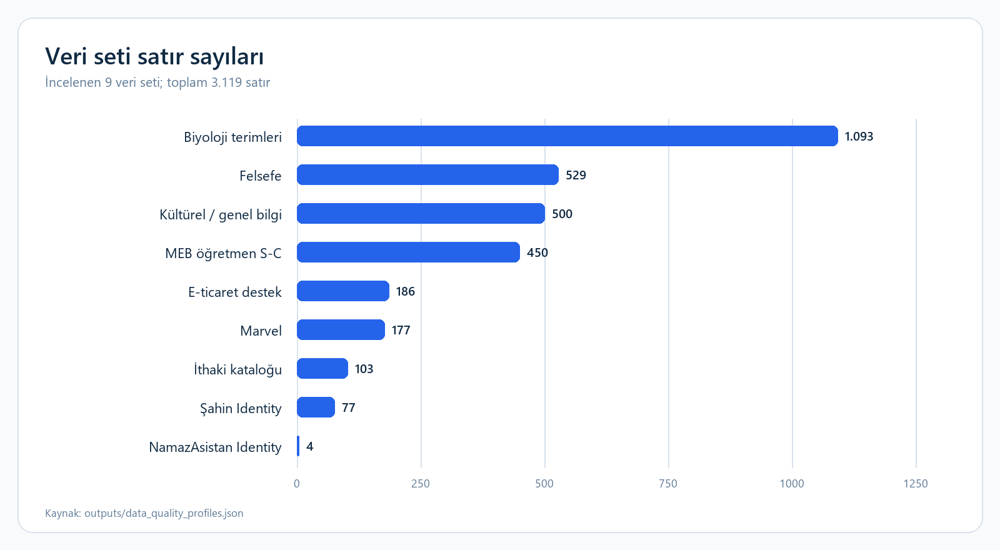
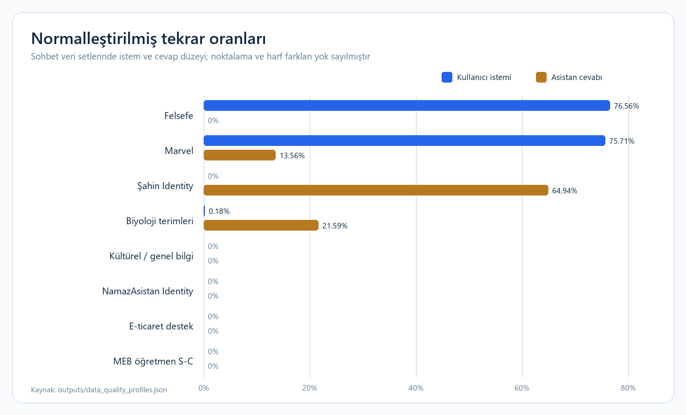

# Hugging Face Veri Setleri: Teknik Değerlendirme Raporu

## Teknik özet

- **Dokuz veri setinde toplam 3.119 satır incelendi.** Bunun 3.016 satırı sekiz
  sohbet veri setinde, 103 satırı ise 17 alanlı İthaki kitap kataloğundadır.
- **Yapısal bütünlük genel olarak iyi, semantik çeşitlilik eşit değil.** Sohbet
  setlerinde boş içerik ve geçersiz rol bulunmazken Marvel ve felsefe istemlerinde,
  biyoloji ve Şahin Identity cevaplarında belirgin normalleştirilmiş tekrar vardır.
- **Mevcut koleksiyon Conversation ve alan soru-cevap eğitimi için kullanılabilir.**
  Buna karşılık gerçek multi-turn diyalog, etiketli tool call, doğrulanabilir
  structured output, genel matematik ve coding örnekleri hazır durumda değildir.
- **Veri hazırlığı görev bazlı yapılmalıdır.** `thinking` içeriğinin nihai cevaptan
  ayrılması, tekrar ailelerinin azaltılması, metin biçimindeki `"null"` değerlerinin
  düzeltilmesi ve zaman hassas cevapların güncel kaynaklara bağlanması gerekir.

**Kapsam tarihi:** 20–21 Temmuz 2026  
**Analiz birimi:** Hugging Face üzerinde yayımlanan sabit veri seti kopyalarının tüm satırları  
**Değerlendirme yaklaşımı:** Puanlama veya sıralama değil; görev uyumu, veri yapısı,
içerik kalitesi ve hazırlık gereksinimi

## İçindekiler

- [Portföyün yapısı](#portföyün-yapısı)
- [Temel kalite bulguları](#temel-kalite-bulguları)
- [Veri seti envanteri](#veri-seti-envanteri)
- [Veri seti bazında değerlendirme](#veri-seti-bazında-değerlendirme)
- [Model yetenek alanlarıyla eşleşme](#model-yetenek-alanlarıyla-eşleşme)
- [Önerilen hedef veri şemaları](#önerilen-hedef-veri-şemaları)
- [Teknik uygulama planı](#teknik-uygulama-planı)
- [Sınırlılıklar ve doğrulama kapsamı](#sınırlılıklar-ve-doğrulama-kapsamı)

## Portföyün yapısı

Veri hacmi birkaç sohbet koleksiyonunda yoğunlaşmaktadır. Biyoloji, felsefe,
genel bilgi ve MEB veri setleri birlikte 2.572 satırla toplam koleksiyonun
%82,46'sını oluşturur. Bu oran yalnız hacmi gösterir; içerik çeşitliliği veya
göreve uygunluk göstergesi değildir.

Grafik, sohbet eğitimi için en geniş içerik havuzlarının hangi veri setlerinde
olduğunu gösterir. Kimlik setlerinin küçük olması beklenen bir durumdur; bu setler
genel alan bilgisi yerine persona ve sahiplik cevaplarını hedefler.

## Temel kalite bulguları

### Yapısal kontroller temiz, tekrar yoğunluğu görev riskini değiştiriyor

Sekiz sohbet veri setinde mesaj rolleri ve içerik alanları geçerlidir. Exact satır
tekrarı gözlenmemiştir; ancak noktalama ve büyük/küçük harf farkları yok sayıldığında
bazı istem veya cevap ailelerinin çok sık tekrarlandığı görülür.

**Yorum:** Felsefe ve Marvel setlerinde aynı istem ailesi çok sayıda cevapla
eşleşir. Şahin Identity'de ise cevap çeşitliliği düşüktür. Biyoloji setinde aynı
tanımın farklı sorularla yinelenmesi, belirli cevap kalıplarına eğitim sırasında
gereğinden fazla ağırlık verebilir. Sıfır görünen değerler içeriklerin olgusal
olarak doğru olduğunu değil, bu normalizasyon kuralına göre tekrar bulunmadığını
ifade eder.

### `thinking`, araç çağrısı ve tip bütünlüğü ayrı veri işlemleri gerektiriyor

| Kontrol | Bulgular | Teknik etkisi |
|---|---:|---|
| `thinking` içeren asistan mesajı | 1.136 | Nihai cevap hedefi ayrı üretilmeli; özel akıl yürütme alanı doğrudan yayımlanmamalı |
| Dolu `tool_calls` alanı | 0 | Tool Call eğitimi için fonksiyon şeması, argüman ve araç sonucu ayrıca oluşturulmalı |
| Gerçek multi-turn kayıt | 0 | Bağlam takibi ve takip sorusu davranışı mevcut koleksiyonla ölçülemez |
| Metin olarak saklanan `"null"` | 462 | Şema doğrulama ve tip normalizasyonu gerekir |
| Prompt–target JSON/tablo örneği | 0 | Structured Output için doğrulanabilir hedef kayıtlar üretilmeli |

### Yetenek alanı kapsamı aynı düzeyde değil

Conversation için doğrudan kullanılabilecek altı alan veri seti vardır. Instruction
katkısı ise genel talimat çeşitliliğinden çok alan soru-cevap davranışıdır. Tool
Call, Structured Output ve Math için içerik kaynağı bulunmasına rağmen hedef örnek
şemaları henüz yoktur. Coding için mevcut koleksiyonda uygun kayıt bulunmamaktadır.

## Veri seti envanteri

| Katılımcı | Veri seti | Satır | Yapı | Temel kullanım |
|---|---|---:|---|---|
| Ali Furkan Ak | [cultural-questions-dataset](https://huggingface.co/datasets/aliFurkan123/cultural-questions-dataset) | 500 | İki mesajlı sohbet | Türkçe genel bilgi ve açıklayıcı cevap |
| Ayşe Nur Yeşilova | [namaz-vakti-identity-tr](https://huggingface.co/datasets/Aysenur44/namaz-vakti-identity-tr) | 4 | System–user–assistant | Model kimliği ve geliştirici bilgisi |
| Ege Ertekin | [marvel-domain-dataset](https://huggingface.co/datasets/Egertekin/marvel-domain-dataset) | 177 | İki mesajlı sohbet | Marvel alan soru-cevapları |
| Gurur Aşer | [ithaki-bilimkurgu-klasikleri](https://huggingface.co/datasets/gururaser/ithaki-bilimkurgu-klasikleri) | 103 | 17 alanlı katalog | Kitap kataloğu ve kontrollü dönüşüm |
| Mehmet Emre Öz | [biyoloji-terimleri-turkce-sa](https://huggingface.co/datasets/nyzmemre/biyoloji-terimleri-turkce-sa) | 1.093 | İki mesajlı sohbet | Türkçe biyoloji terim açıklamaları |
| Mert Ali Alkan | [TR-ECommerce-CustomerSupport-Instructions](https://huggingface.co/datasets/Mer1Alii/TR-ECommerce-CustomerSupport-Instructions) | 186 | İki mesajlı sohbet | E-ticaret müşteri desteği |
| Muhammet Yusuf Kaydın | [felsefe_finetune](https://huggingface.co/datasets/yoitsmeyusuf/felsefe_finetune) | 529 | İki mesajlı sohbet | Öznel felsefe söylemi |
| Mustafa Özdemir | [meb-ogretmen-soru-cevap](https://huggingface.co/datasets/namruni/meb-ogretmen-soru-cevap) | 450 | İki mesajlı sohbet | Öğretmen mevzuatı ve uygulama soruları |
| Serhat Kılıç | [sahin_identity](https://huggingface.co/datasets/sk75/sahin_identity) | 77 | İki mesajlı sohbet | Türkçe/İngilizce model kimliği |

## Veri seti bazında değerlendirme

### Ali Furkan Ak — genel bilgi için temiz bir çekirdek, kaynak doğrulaması gerekli

**Ne yapıyor?** Türkçe genel bilgi, trivia ve açıklayıcı tek turlu diyaloglar
sağlıyor.

**Artıları**

- 500 satırın tamamında kullanıcı ve asistan içeriği doludur.
- Exact veya normalleştirilmiş istem/cevap tekrarı tespit edilmemiştir.
- Standart sohbet şeması ve yönetilebilir yanıt uzunlukları SFT dönüşümünü kolaylaştırır.

**Eksileri ve riskleri**

- İçerik sentetiktir; olgusal cevaplarda satır düzeyinde kaynak veya doğrulama alanı yoktur.
- 500 asistan mesajının tamamında ayrı `thinking` içeriği vardır.
- Veri seti adı kültürel soru izlenimi verse de içerik daha geniş genel bilgi kapsamındadır.

**Hazırlık kararı:** Olgusal doğrulama, konu etiketi ve yalnız nihai cevabı taşıyan
bir hedef sürüm üretildikten sonra Conversation ve dar Instruction görevlerinde
kullanılabilir.

### Ayşe Nur Yeşilova — kimlik tohumu olarak uygun, alan yetkinliği sağlamıyor

**Ne yapıyor?** NamazAsistan-v1 model adı, geliştirici ve temel yetenek kimliğini
dört system–user–assistant kaydıyla tanımlıyor.

**Artıları**

- Dört kaydın tamamında mesaj sırası ve içerik geçerlidir.
- Standart `messages` alanı doğrudan persona/identity eğitimine uyarlanabilir.

**Eksileri ve riskleri**

- Dört satır, namaz vakti, dua veya ibadet alan yetkinliği öğretmez.
- Güvenlik ilkeleri, kapsam sınırları ve ayrıntılı reddetme davranışları yoktur.
- Dört kullanıcı istemi Şahin Identity veri setiyle örtüşür.

**Hazırlık kararı:** Genel eğitim verisi yerine düşük ağırlıklı çekirdek kimlik
tohumu olarak tutulmalı; güvenlik ve sınır örnekleri ayrı veriyle tamamlanmalıdır.

### Ege Ertekin — alan içeriği zengin, istem çeşitliliği belirgin biçimde düşük

**Ne yapıyor?** Türkçe Marvel evreni, karakter geçmişi ve çizgi roman tarihi
sorularına uzun cevaplar veriyor.

**Artıları**

- 177 satırın tamamında geçerli kullanıcı–asistan dizisi vardır.
- Uzun cevaplar alan terminolojisi ve karakter geçmişi bakımından zengindir.
- Veri kartı, Wikipedia kazıma ve elle çoğaltma yaklaşımını açıklar.

**Eksileri ve riskleri**

- 134 kullanıcı istemi normalleştirilmiş tekrardır: **%75,71**.
- Tek bir Spider-Man sorusu 83 kez yinelenir.
- Kaynak sayfa URL'si, revizyon kimliği ve satır düzeyinde atıf zinciri yoktur.
- Veri kartının tarif ettiği sütunlarla gerçek `messages` şeması uyuşmaz.

**Hazırlık kararı:** Özgül soru üretimi, tekrar kümeleme ve kaynak bağlantısı
eklenmeden eğitim havuzuna alınmamalıdır.

### Gurur Aşer — yapılandırılmış dönüşüm için güçlü katalog kaynağı

**Ne yapıyor?** İthaki Bilimkurgu Klasikleri serisini 103 kayıt ve 17 katalog
alanıyla sunuyor.

**Artıları**

- Exact tekrar, ISBN/URL ve kitap–yazar anahtar tekrarı yoktur.
- ISBN-13 ve URL kontrolleri geçerlidir.
- Fiyat ve indirim alanları kendi içinde tutarlıdır.
- Yapılandırılmış alanlar JSON, tablo, arama ve filtreleme görevleri üretmeye uygundur.

**Eksileri ve riskleri**

- Çevirmen, kapak tipi, özgün ad ve yayın tarihi alanlarında eksikler vardır.
- Fiyatlar anlık görüntüdür; satır düzeyinde `collected_at` alanı bulunmaz.
- Üretilmiş özetlerin doğruluğu ve üst kaynak hakları ayrıca doğrulanmalıdır.
- Kaynak sayfasındaki CC BY-NC 4.0 bildirimi ticari kullanımı sınırlar.

**Hazırlık kararı:** Structured Output, kitap arama Tool Call ve dar fiyat/indirim
Math görevleri için dönüşüm kaynağı olarak kullanılabilir; mevcut hali prompt–target
eğitim seti değildir.

### Mehmet Emre Öz — kapsam geniş, cevap ailesi tekrarları azaltılmalı

**Ne yapıyor?** 1.093 satırda Türkçe biyoloji terimleri için kısa bilimsel
açıklamalar sunuyor.

**Artıları**

- 1.093 satırla geniş bir konu ve terim hacmi sağlar.
- Rol ve içerik alanları geçerlidir; boş içerik veya exact satır tekrarı yoktur.
- Kısa terim açıklaması biçimi açık ve dönüşümü kolaydır.

**Eksileri ve riskleri**

- 236 asistan cevabı normalleştirilmiş tekrardır: **%21,59**.
- Kaynak kitap, sürüm ve üretim yöntemi alanları yoktur.
- Aynı tanımın farklı istemlerle tekrarı belirli cevap kalıplarını aşırı ağırlıklandırabilir.

**Hazırlık kararı:** Terim kimliği, kaynak alanı ve cevap ailesi bazlı tekrar
azaltma sonrasında Conversation ve alan Instruction verisi olarak kullanılabilir.

### Mert Ali Alkan — müşteri destek davranışı iyi, politika içeriği doğrulanmalı

**Ne yapıyor?** Türkçe e-ticaret müşteri destek konuşmalarında empati, açıklama
ve sonraki adım önerisi üretiyor.

**Artıları**

- 186 satırın tamamı yapısal olarak geçerli, dolu ve benzersizdir.
- Üretim yöntemi ayrıntılıdır.
- Müşteri destek tonu ve sorun çözme akışı uygulamaya yakındır.

**Eksileri ve riskleri**

- Tüm asistan mesajlarında `thinking` alanı vardır.
- Sentetik politika, hukuk, garanti ve iletişim bilgileri gerçek şirket davranışı gibi öğrenilebilir.
- Gerçek görünümlü bir e-posta adresi yer tutucuya çevrilmelidir.

**Hazırlık kararı:** Politika metinleri doğrulanmalı, iletişim bilgileri
anonimleştirilmeli ve Tool Call hedefleniyorsa sipariş/destek fonksiyon şemaları
ayrıca yazılmalıdır.

### Muhammet Yusuf Kaydın — öznel söylem için değerli, olgusal veri olarak uygun değil

**Ne yapıyor?** Ekşi Sözlük ve Reddit kaynaklı Türkçe felsefe tartışmalarını ve
öznel görüşleri içeriyor.

**Artıları**

- 529 satırda boş içerik, geçersiz rol veya exact satır tekrarı yoktur.
- Aynı konuya farklı bakış açıları sunan uzun cevaplar vardır.
- Topluluk dili ve öznel görüş üretimi araştırmalarında kullanılabilir.

**Eksileri ve riskleri**

- 405 kullanıcı istemi normalleştirilmiş tekrardır: **%76,56**.
- Çelişkili görüşler tek doğru cevap gibi öğrenilebilir.
- Satır düzeyinde kaynak URL'si ve içerik kaldırma mekanizması yoktur.
- README 527 satır bildirirken gerçek split 529 satırdır.

**Hazırlık kararı:** Yalnız görüş çeşitliliği ve öznel diyalog görevlerinde,
kaynak türü ve görüş etiketi korunarak kullanılmalıdır.

### Mustafa Özdemir — gerçek kullanım bağlamı güçlü, güncellik katmanı zorunlu

**Ne yapıyor?** Öğretmen atama, özlük, izin ve mevzuat sorularına uzun Türkçe
cevaplar sağlıyor.

**Artıları**

- 450 satırın tamamı yapısal olarak geçerli ve benzersizdir.
- Üretim sürecinde forum soruları, 23 resmî kaynak, model hakemi ve insan örnek kontrolü kullanılmıştır.
- Sorular gerçek kullanım bağlamına, cevaplar uygulanabilir açıklama biçimine yakındır.

**Eksileri ve riskleri**

- Veri kartına göre cevapların yalnız %41'i resmî kaynak atfı taşır.
- 297 satırda zaman hassas ifade tespit edilmiştir.
- Tüm asistan mesajlarında `thinking` alanı vardır.
- İdari etkili cevaplar güncel kaynak getirilmeden kesin yanıt gibi sunulmamalıdır.

**Hazırlık kararı:** Güncel resmî kaynak getirme, geçerlilik tarihi, atıf zorunluluğu
ve belirsizlik diliyle Conversation/Instruction kaynağı olabilir.

### Serhat Kılıç — iki dilli kimlik çeşitliliği var, tip ve tekrar temizliği gerekli

**Ne yapıyor?** Türkçe ve İngilizce kimlik, sahiplik, geliştirici ve yetenek
sorularına cevap veriyor.

**Artıları**

- 77 satır iki dilde kimlik varyasyonları sağlar.
- Kimlik ve geliştirici sorularını doğrudan hedefler.

**Eksileri ve riskleri**

- 50 asistan cevabı normalleştirilmiş tekrardır: **%64,94**.
- 154 mesajdaki `images`, `thinking` ve `tool_calls` alanları gerçek `null` yerine
  `"null"` dizesi taşır; toplam 462 tip hatası vardır.
- Güvenlik, sınır ve tutarlı ret davranışı sınırlıdır.
- NamazAsistan Identity ile dört ortak kullanıcı istemi bulunur.

**Hazırlık kararı:** Tip düzeltmesi ve tekrar azaltma sonrasında düşük ağırlıklı,
iki dilli Identity tohumu olarak kullanılabilir.

## Model yetenek alanlarıyla eşleşme

| Alan | Mevcut karşılık | Kullanılabilecek kaynaklar | Hazırlanması gerekenler |
|---|---|---|---|
| Identity | 2 doğrudan | NamazAsistan Identity, Şahin Identity | Güvenlik, sınır, tutarlı ret ve kapsam dışı soru örnekleri |
| Tool Call | 3 dönüşüm kaynağı | İthaki, e-ticaret, MEB | Araç şeması, argüman, sonuç, hata ve nihai cevap zinciri |
| Conversation | 6 doğrudan, 2 kısmi | Genel bilgi, Marvel, e-ticaret, MEB, biyoloji, felsefe; kimlik setleri persona desteği | Multi-turn takip, düzeltme, konu geçişi ve uzun bağlam |
| Instruction | 6 kısmi | E-ticaret, MEB, genel bilgi, biyoloji, Marvel, felsefe | Özetleme, yeniden yazma, sınıflandırma, biçim kısıtı ve çok adımlı görev |
| Structured Output | 1 dönüşüm kaynağı | İthaki kataloğu | Prompt ile doğrulanabilir JSON/tablo hedefleri |
| Math | 1 dar dönüşüm kaynağı | İthaki fiyat ve indirim alanları | Çözüm adımı, birim testleri ve genel matematik çeşitliliği |
| Coding | Karşılık yok | — | Kod üretimi, test, hata ayıklama, açıklama, refactor ve algoritma verisi |

Alan bazındaki ayrıntılı tasarım ve kayıt sözleşmeleri için
[Model Yetenek Alanları Eşleştirme Raporu](Model_Yetenek_Alanlari_Eslestirme_Raporu.md)
kullanılabilir.

## Önerilen hedef veri şemaları

| Alan | Önerilen kayıt biçimi | Zorunlu alanlar | Temel doğrulama |
|---|---|---|---|
| Identity | `messages` + persona metadata | `system`, `user`, `assistant`, `persona_id`, `language`, `policy_scope` | Kimlik tutarlılığı, sınır ve ret davranışı testleri |
| Tool Call | Araç tanımı + çağrı + sonuç + cevap | `tools`, `tool_name`, `arguments`, `tool_result`, `assistant_final` | JSON Schema, araç adı, argüman tipi ve sonuç bağımlılığı |
| Conversation | Çok turlu mesaj dizisi | `conversation_id`, `turn_index`, `role`, `content`, `topic` | Rol sırası, bağlam referansı ve tur bütünlüğü |
| Instruction | İstem–kısıt–hedef üçlüsü | `instruction`, `constraints`, `input`, `target` | Kısıt karşılanması ve görev türü kontrolü |
| Structured Output | İstem + şema + çıktı | `prompt`, `schema`, `target_json` | JSON parse, şema uyumu ve alan tipi kontrolü |
| Math | Problem + çözüm + cevap | `problem`, `solution_steps`, `final_answer`, `unit` | Yeniden hesaplama ve birim tutarlılığı |
| Coding | Görev + bağlam + kod + test | `task`, `language`, `context`, `solution`, `tests` | Derleme/çalıştırma, test ve güvenli kod kontrolü |

## Teknik uygulama planı

1. **Ortak kanonik şema oluşturun.** Kaynak veri seti, commit kimliği, dil, görev
   türü ve özgün satır kimliğini her kayıtta koruyun.
2. **Mesaj tiplerini normalize edin.** `"null"` dizelerini gerçek `null` değerine
   dönüştürün; rol sırası ve içerik tiplerini JSON Schema ile doğrulayın.
3. **Tekrar ailelerini kümeleyin.** Exact kontrolün yanında normalleştirilmiş istem
   ve cevap anahtarlarını kullanın; eğitim ağırlığını küme büyüklüğüne göre dengeleyin.
4. **`thinking` ve nihai cevabı ayırın.** Yayımlanacak SFT hedefinde yalnız
   kullanıcıya gösterilecek nihai cevabı tutun.
5. **Dönüşüm görevlerini açık şemayla üretin.** İthaki, e-ticaret ve MEB kaynaklarından
   Tool Call veya Structured Output türetilirken her hedefi deterministik doğrulayıcıyla sınayın.
6. **Zaman hassas cevapları kaynak katmanına bağlayın.** MEB ve politika içeren
   e-ticaret örneklerinde geçerlilik tarihi ve resmî kaynak alanı zorunlu olsun.
7. **Alan bazlı kabul testleri yazın.** JSON Schema, araç argümanı, matematik
   yeniden hesaplama, kod testi ve çok turlu bağlam kontrolü ayrı test takımları olsun.

## Sınırlılıklar ve doğrulama kapsamı

- Normalleştirilmiş tekrar analizi noktalama ve harf farklarını yok sayar; tam
  anlamsal benzerlik modeli değildir.
- Kişisel veri taraması regex tabanlıdır; bağlamsal kişi ve kurum adlarını bütünüyle yakalayamaz.
- Olgusal cevapların tamamı alan uzmanı tarafından yeniden doğrulanmamıştır.
- Analiz, veri seti anlık görüntülerini değerlendirir; kaynak depolar sonradan değişebilir.
- Bu çalışma model eğitimi veya benchmark sonucu içermez; veri kalitesi ve görev
  uyumu bulguları doğrudan model performansı iddiasına dönüştürülemez.

## Kanıt ve yeniden üretilebilirlik

- [Çalıştırılmış Jupyter notebook](../notebook/huggingface_dataset_quality_analysis.ipynb)
- [Tarayıcıda açılabilen notebook HTML çıktısı](../notebook/huggingface_dataset_quality_analysis.html)
- [Tam veri kalite profilleri](../outputs/data_quality_profiles.json)
- [Manuel bulgular](../outputs/manual_findings.json)
- [Veri setleri arası örtüşme](../outputs/cross_dataset_overlap.json)
- [Kaynak envanteri](../outputs/source_inventory.json)
- [Yetenek alanı manifesti](../ekler/dataset_manifest.json)
- [CSV alan eşleştirmesi](../ekler/alan_eslestirmesi.csv)

Grafikler [`scripts/generate_report_charts.py`](../scripts/generate_report_charts.py)
ile bu depodaki JSON çıktılarından yeniden üretilebilir.

## İleri çalışma soruları

- Eğitimde hangi yetenek alanları birlikte, hangileri ayrı adaptör veya veri karışımıyla ele alınmalı?
- Zaman hassas alanlarda kaynak getirme başarısı nasıl ölçülmeli?
- Normalleştirilmiş tekrar kümelerinde korunacak örnek sayısı görev bazında nasıl belirlenmeli?
- Identity davranışı için güvenlik ve kapsam sınırı testleri hangi senaryoları içermeli?
- Tool Call, Structured Output, Math ve Coding veri üretiminde otomatik doğrulama eşiği ne olmalı?
