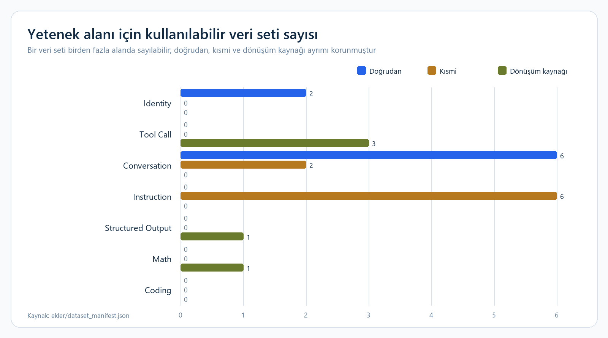

# Model Yetenek Alanları Eşleştirme Raporu

[Ana teknik değerlendirme](HuggingFace_Veri_Setleri_Yetenek_Alani_Raporu.md) ·
[Depo ana sayfası](../README.md) ·
[Makinece okunabilir manifest](../ekler/dataset_manifest.json)

## Teknik özet

- **Identity için iki doğrudan veri seti vardır;** kimlik ve geliştirici cevapları
  mevcut olsa da güvenlik, kapsam sınırı ve tutarlı ret davranışı ayrıca hazırlanmalıdır.
- **Conversation için altı doğrudan ve iki persona destek kaynağı bulunur;** mevcut
  örnekler tek turludur ve gerçek multi-turn bağlam takibi sağlamaz.
- **Instruction katkısı altı veri setinde kısmi düzeydedir;** bunlar genel talimat
  çeşitliliğinden çok alan soru-cevap davranışı öğretir.
- **Tool Call, Structured Output ve Math dönüşüm gerektirir; Coding karşılığı yoktur.**
  Bu alanlar için hedef kayıt şemaları ve otomatik doğrulayıcılar ayrıca yazılmalıdır.

## Kapsam ve eşleştirme ölçütleri

Bu çalışma yalnızca daha önce indirilen ve tam satır analizi yapılan dokuz
Hugging Face veri setini kapsar. Yeni veri seti eklenmemiştir. Eşleştirme,
veri seti adından değil gerçek satır şeması ve içeriklerinden yapılmıştır.

### Eşleştirme düzeyleri

- **Doğrudan:** Mevcut satırlar bu yetenek için eğitim örneği olarak kullanılabilir.
- **Kısmi:** İlgili davranışa katkı sağlar ancak yeteneğin tamamını öğretmez.
- **Dönüştürme kaynağı:** Ham içerik uygundur; hedef örneklerin ayrıca üretilmesi ve doğrulanması gerekir.
- **Bulunmuyor:** Mevcut dokuz veri setinde bu yeteneğe ait etiketli eğitim örneği yoktur.

## Genel Eşleştirme

| Alan | Proje durumu | Mevcut veri setleri | Sonuç |
|---|---|---|---|
| Identity | Tamamlandı | `Aysenur44/namaz-vakti-identity-tr`, `sk75/sahin_identity` | Doğrudan kimlik örnekleri var; güvenlik ilkeleri ve ayrıntılı sınır cevapları eksik. |
| Tool Call | Planlandı | Doğrudan veri seti yok | İthaki, e-ticaret ve MEB içerikleri dönüştürme kaynağı olabilir. |
| Conversation | Planlandı | Genel bilgi, Marvel, e-ticaret, MEB, biyoloji ve felsefe | Tek seferlik diyalog için kullanılabilir; gerçek multi-turn bağlam takibi yok. |
| Instruction | Planlandı | E-ticaret, MEB, genel bilgi, biyoloji, Marvel ve felsefe | Alan soru-cevap eğitimi sağlar; geniş kapsamlı talimat izleme için kısmi kalır. |
| Structured Output | Planlandı | Doğrudan hedef çıktı veri seti yok | İthaki kataloğu JSON/tablo hedeflerine dönüştürülebilir. |
| Math | Planlandı | Doğrudan veri seti yok | İthaki fiyat/indirim alanlarından sınırlı aritmetik örnekleri türetilebilir. |
| Coding | Planlandı | Veri seti yok | Mevcut koleksiyonda kod yazma, hata ayıklama veya refactor örneği bulunmuyor. |

Grafik, veri seti sayısını eşleşme düzeyine göre gösterir. Conversation kapsamı
görece geniştir; Instruction kayıtları kısmi, Tool Call ve yapılandırılmış görevler
ise dönüşüm kaynağı düzeyindedir. Sayılar model başarısını veya veri kalitesini
değil, mevcut içeriğin hangi görev biçimine ne kadar yakın olduğunu ifade eder.

## Hedef kayıt ve doğrulama sözleşmesi

| Alan | Önerilen kayıt | Zorunlu alanlar | Kabul kontrolü |
|---|---|---|---|
| Identity | Persona metadata içeren `messages` | `system`, `user`, `assistant`, `persona_id`, `language`, `policy_scope` | Aynı kimliğe tutarlı cevap, kapsam dışı soruda sınır davranışı |
| Tool Call | Araç tanımı + çağrı + sonuç + nihai cevap | `tools`, `tool_name`, `arguments`, `tool_result`, `assistant_final` | JSON Schema, araç adı, argüman tipi, sonucun cevapta doğru kullanımı |
| Conversation | Çok turlu mesaj dizisi | `conversation_id`, `turn_index`, `role`, `content`, `topic` | Rol sırası, önceki mesaja referans ve tur bütünlüğü |
| Instruction | Görev, girdi, kısıt ve hedef | `instruction`, `input`, `constraints`, `target` | Görev türü ve bütün kısıtların karşılanması |
| Structured Output | İstem + şema + çıktı | `prompt`, `schema`, `target_json` | JSON parse, zorunlu alan ve veri tipi doğrulaması |
| Math | Problem + çözüm + nihai cevap | `problem`, `solution_steps`, `final_answer`, `unit` | Yeniden hesaplama, tolerans ve birim tutarlılığı |
| Coding | Görev + bağlam + çözüm + test | `task`, `language`, `context`, `solution`, `tests` | Derleme/çalıştırma, test sonucu ve güvenli kod kontrolü |

## Identity — Tamamlandı

### Doğrudan veri setleri

1. [Aysenur44/namaz-vakti-identity-tr](https://huggingface.co/datasets/Aysenur44/namaz-vakti-identity-tr)

   - **Satır:** 4
   - **Kapsam:** Model adı, geliştirici, kimlik ve temel yetenek açıklaması.
   - **Artısı:** `system → user → assistant` düzeni doğrudan kimlik eğitimi için uygundur.
   - **Sınırı:** Dört satır alan yetkinliği, güvenlik ilkeleri ve ayrıntılı reddetme/sınır davranışı sağlamaz. Lisans belirtilmemiştir.
   - **Kaynak erişimi:** Ham veri bu teslim deposunda çoğaltılmamıştır; yukarıdaki Hugging Face bağlantısı kullanılır.

2. [sk75/sahin_identity](https://huggingface.co/datasets/sk75/sahin_identity)

   - **Satır:** 77
   - **Kapsam:** Türkçe ve İngilizce kimlik, sahiplik, geliştirici ve yetenek cevapları.
   - **Artısı:** İki dilde kimlik varyasyonu içerir.
   - **Sınırı:** Asistan cevaplarının %64,94'ü normalleştirilmiş tekrardır; 462 alanda gerçek `null` yerine `"null"` dizesi vardır. README ve lisans yoktur.
   - **Kaynak erişimi:** Ham veri bu teslim deposunda çoğaltılmamıştır; yukarıdaki Hugging Face bağlantısı kullanılır.

> Projedeki **Tamamlandı** durumu korunmuştur. Ancak verilen Identity tanımındaki
> “sınırlar ve güvenlik ilkeleri” bölümü bu iki veri setinde yeterli kapsamda
> bulunmadığı için ayrıca test verisiyle tamamlanmalıdır.

## Tool Call — Planlandı

### Doğrudan eşleşme

**Bulunmuyor.** Sekiz sohbet veri setindeki `tool_calls` alanları boş/null; `tool`
rolü, fonksiyon adı, argüman, fonksiyon sonucu veya sonuçtan kullanıcı cevabı
üretme zinciri yoktur.

### Dönüştürülebilecek kaynaklar

- [gururaser/ithaki-bilimkurgu-klasikleri](https://huggingface.co/datasets/gururaser/ithaki-bilimkurgu-klasikleri): `search_books`, `filter_books` ve `get_book_details` gibi araçlar için 103 yapılandırılmış katalog kaydı kullanılabilir.
- [Mer1Alii/TR-ECommerce-CustomerSupport-Instructions](https://huggingface.co/datasets/Mer1Alii/TR-ECommerce-CustomerSupport-Instructions): `get_order_status`, `cancel_order` ve `create_support_ticket` senaryolarına dönüştürülebilir. Gerçek dışı politika ve iletişim iddiaları önce temizlenmelidir.
- [namruni/meb-ogretmen-soru-cevap](https://huggingface.co/datasets/namruni/meb-ogretmen-soru-cevap): `search_regulation` ve `fetch_official_notice` araçlarına dönüştürülebilir; sonuçlar güncel resmî kaynaklardan gelmelidir.

Bu kaynaklar Tool Call veri seti değildir. Fonksiyon şeması, doğru argümanlar,
araç sonucu, hata senaryosu ve sonuçtan üretilen nihai cevap ayrıca yazılmalıdır.

## Conversation — Planlandı

### Tek seferlik diyalog için kullanılabilecek veri setleri

| Veri seti | Satır | Kullanım | Temel sınırlama |
|---|---:|---|---|
| [aliFurkan123/cultural-questions-dataset](https://huggingface.co/datasets/aliFurkan123/cultural-questions-dataset) | 500 | Türkçe genel bilgi ve açıklayıcı cevap | Sentetik olgular kaynaklandırılmamış; tüm asistan örneklerinde `thinking` var. |
| [Egertekin/marvel-domain-dataset](https://huggingface.co/datasets/Egertekin/marvel-domain-dataset) | 177 | Alan odaklı Türkçe soru-cevap | Kullanıcı istemlerinin %75,71'i tekrar; kaynak/lisans zinciri eksik. |
| [Mer1Alii/TR-ECommerce-CustomerSupport-Instructions](https://huggingface.co/datasets/Mer1Alii/TR-ECommerce-CustomerSupport-Instructions) | 186 | Müşteriyle doğal ve çözüm odaklı konuşma | Sentetik şirket politikaları yanlış davranış öğretebilir; `thinking` kaldırılmalı. |
| [namruni/meb-ogretmen-soru-cevap](https://huggingface.co/datasets/namruni/meb-ogretmen-soru-cevap) | 450 | Uzun, bağlamlı öğretmen soru-cevapları | Zaman hassas mevzuat; lisans yok; güncel kaynak getirme gerekir. |
| [nyzmemre/biyoloji-terimleri-turkce-sa](https://huggingface.co/datasets/nyzmemre/biyoloji-terimleri-turkce-sa) | 1.093 | Kısa Türkçe bilimsel açıklamalar | Cevapların %21,59'u tekrar; kaynak ve lisans yok. |
| [yoitsmeyusuf/felsefe_finetune](https://huggingface.co/datasets/yoitsmeyusuf/felsefe_finetune) | 529 | Öznel ve farklı görüş içeren Türkçe cevaplar | İstemlerin %76,56'sı tekrar; görüşler doğrulanmış bilgi gibi kullanılmamalı. |

Identity veri setleri persona konuşmalarına düşük ağırlıkla eklenebilir; genel
Conversation setinin ana gövdesi olmamalıdır.

### Eksik kapsam

Mevcut satırlar çoğunlukla `user → assistant` biçimindedir. Önceki kullanıcı
mesajına gönderme, düzeltme, takip sorusu, konu değiştirme ve çok turlu bağlam
koruma örnekleri bulunmadığı için **multi-turn Conversation ayrıca üretilmelidir**.

## Instruction — Planlandı

Mevcut soru-cevap setleri, dar alan talimatlarına cevap vermeyi kısmen öğretir:

- E-ticaret: kullanıcı talebini anlayıp destek cevabı üretme.
- MEB: uzun bir sorudan uygulanabilir açıklama üretme.
- Genel bilgi ve biyoloji: bilgi istemini açıklayıcı cevapla karşılama.
- Marvel: alan sorularını cevaplama; tekrarlar düzeltilmeden kullanılmamalı.
- Felsefe: görüş üretme; olgusal instruction seti olarak kullanılmamalı.

Ancak özetleme, yeniden yazma, sınıflandırma, karşılaştırma, biçim kısıtı,
çok adımlı görev, olumsuz kısıt ve örnekle yönlendirme gibi instruction-following
çeşitliliği yoktur. Bu nedenle bu veri setleri **genel Instruction veri seti
değil, alan SFT kaynağıdır**.

## Structured Output — Planlandı

### Doğrudan eşleşme

**Bulunmuyor.** Hiçbir sohbet veri setinde kullanıcı talebine karşı doğrulanabilir
JSON, tablo veya belirli şemaya bağlı hedef asistan çıktısı yoktur.

### Dönüştürme kaynağı

[gururaser/ithaki-bilimkurgu-klasikleri](https://huggingface.co/datasets/gururaser/ithaki-bilimkurgu-klasikleri)
103 satır ve 17 alanlı yapılandırılmış bir katalogdur. Aşağıdaki hedefler için
kullanılabilir:

- Kitap bilgisini sabit JSON şemasına dönüştürme
- Filtrelenmiş sonuçları Markdown tablo olarak verme
- Eksik alanları gerçek `null` ile döndürme
- ISBN, fiyat ve indirim alanlarında tür doğrulaması

Katalog zaten yapılandırılmış veri olsa da mevcut haliyle prompt/target Structured
Output eğitim seti değildir; görev istemleri ve beklenen çıktılar oluşturulmalıdır.

## Math — Planlandı

### Doğrudan eşleşme

**Bulunmuyor.** Matematik problemi, çözüm adımı veya doğrulanmış nihai matematik
cevabı içeren veri seti yoktur.

İthaki kataloğundaki `eski_fiyat`, `satis_fiyati` ve `indirim_orani` alanları
temel yüzde/indirim soruları üretmek için kullanılabilir. Bu yalnızca dar kapsamlı
aritmetik sağlar; cebir, geometri, olasılık veya ileri matematik yerine geçmez.

## Coding — Planlandı

**Bulunmuyor.** Mevcut dokuz veri setinde kod üretimi, test yazma, hata ayıklama,
kod açıklama, refactor, algoritma veya teknik problem çözme hedefi yoktur.
Alanla ilgisi olmayan metinleri Coding etiketiyle kullanmak eğitim kalitesini
düşüreceğinden mevcut koleksiyondan Coding seti seçilmemiştir.

## Uygulama kararları

- Identity dışındaki durumlar kullanıcı tarafından verilen şekilde `Planlandı` olarak korunmuştur.
- Aynı veri seti birden fazla alana katkı sağlayabilir; bu, içeriğin her alanda doğrudan hazır olduğu anlamına gelmez.
- `thinking` içeren 1.136 asistan mesajından ayrıca yalnızca nihai cevabı taşıyan bir sürüm oluşturulmalıdır.
- Tool Call, Structured Output, Math ve Coding kayıtları yalnız otomatik doğrulayıcıları geçtikten sonra eğitim havuzuna alınmalıdır.
- Alan bazındaki ayrıntılı veri kalitesi riskleri için [ana teknik rapor](HuggingFace_Veri_Setleri_Yetenek_Alani_Raporu.md) kullanılmalıdır.
