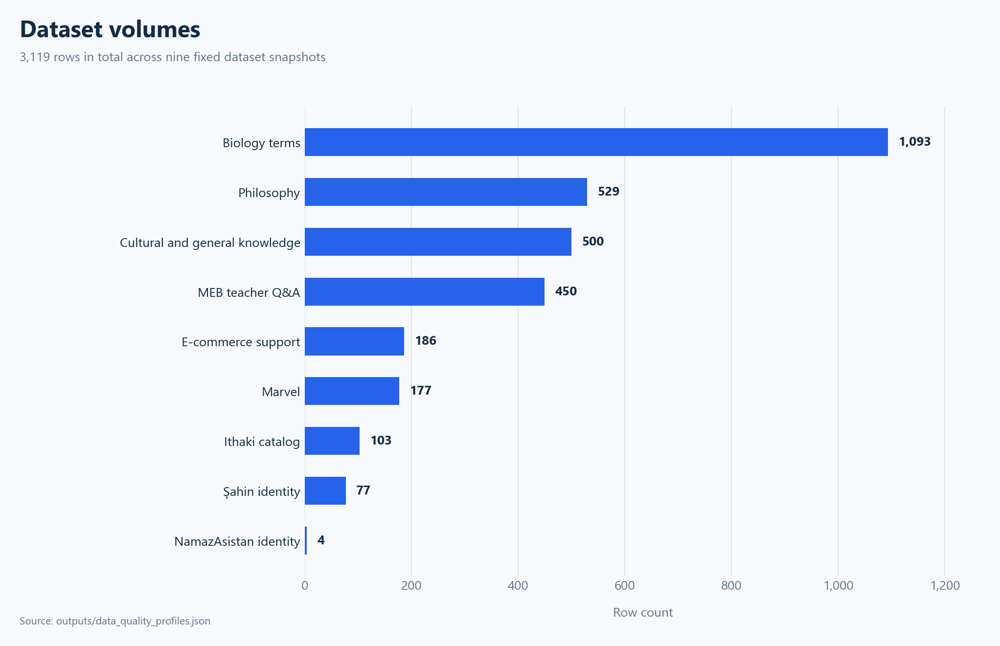
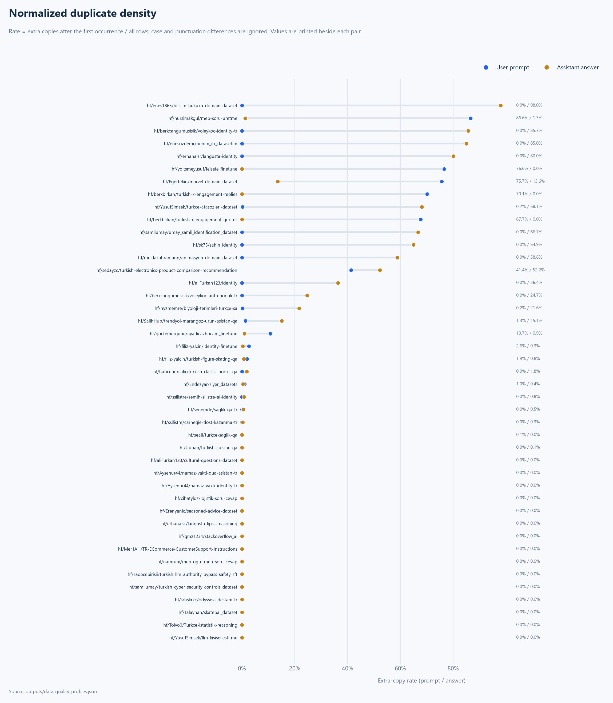
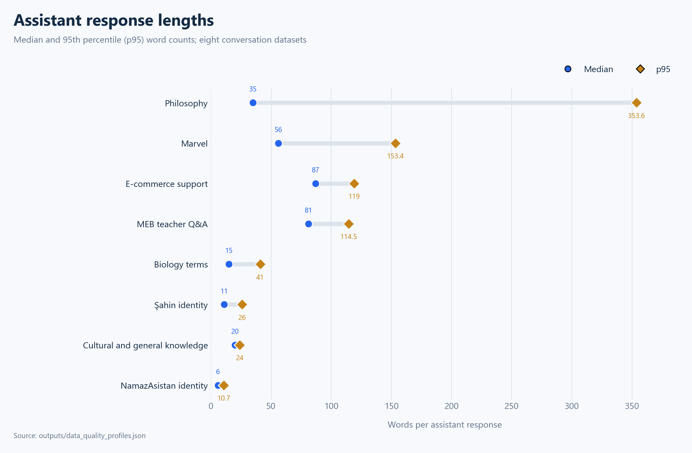
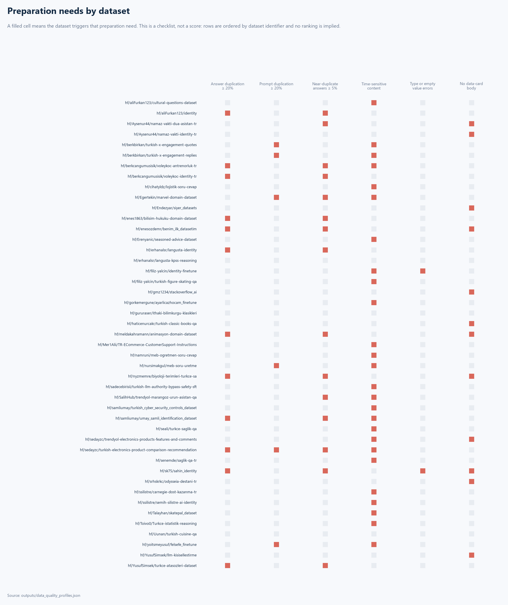
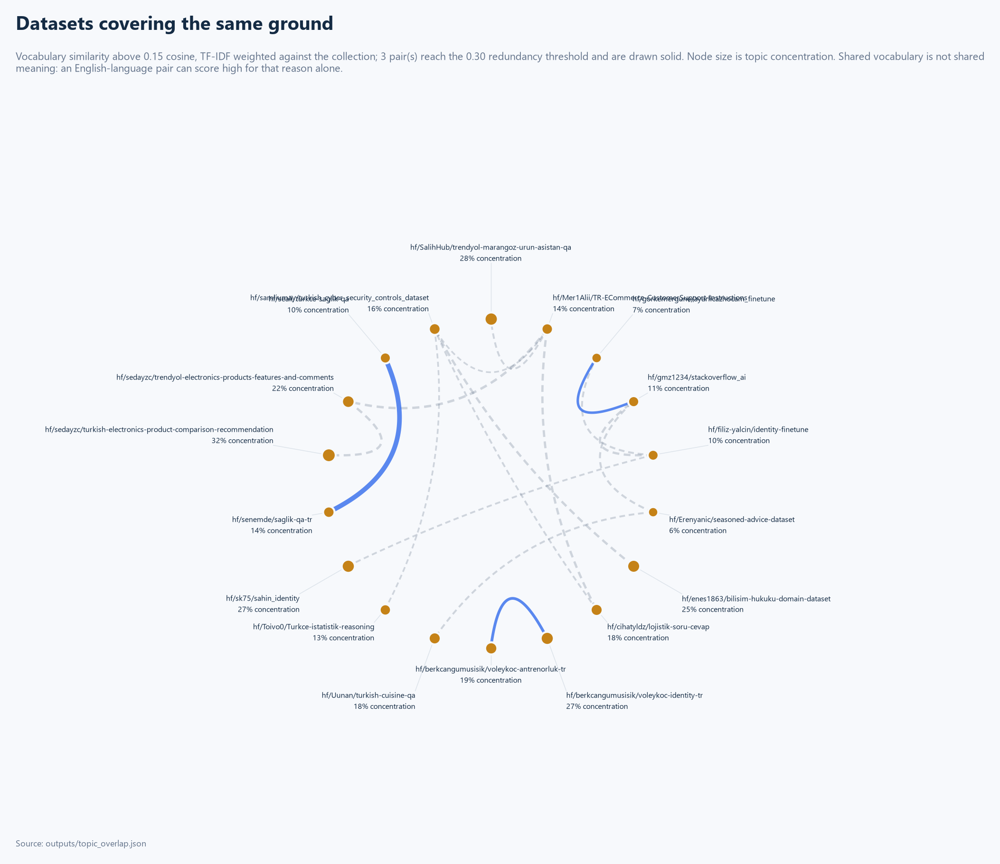
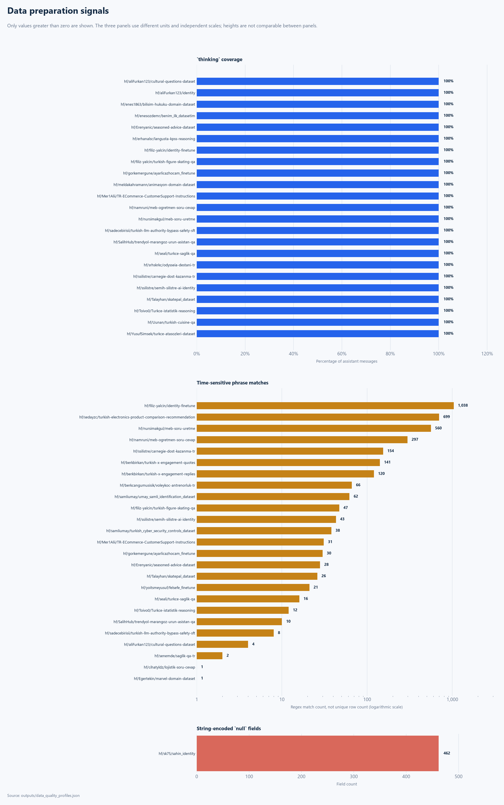
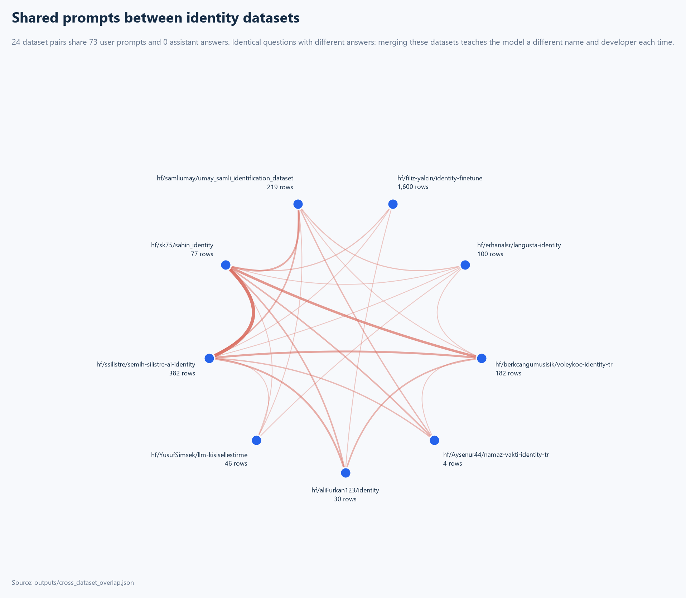
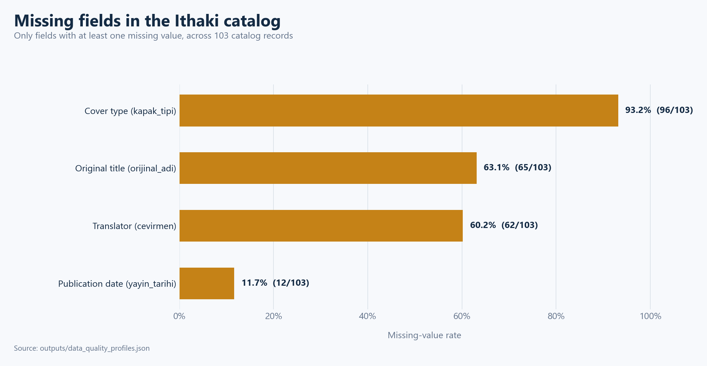
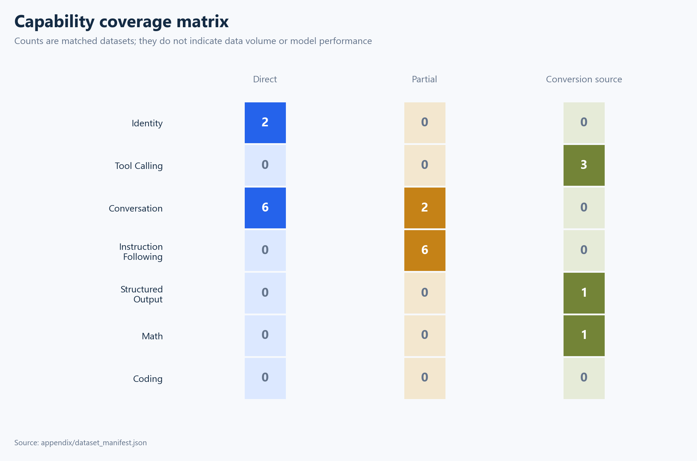

# Hugging Face Datasets: Technical Assessment

## Technical summary

- **87,831 rows across 45 datasets were reviewed.** 87,228 sit in 43 conversation
  datasets, 500 in a product table, and 103 in a 17-field book catalog.
- **Structural integrity is high; content diversity is not.** There are no invalid
  roles and no record whose prompt equals its own answer, but 5,033 rows are exact
  duplicates and several datasets repeat one answer across most of their rows.
- **Explicit reasoning has become the default.** 67,470 assistant messages carry a
  separate `thinking` field. In the previous nine-dataset scope this was a
  minority pattern; it is now the dominant one.
- **Structured Output has its first direct source.** One dataset contributes
  17,454 schema-bound JSON answers. Tool Calling and Coding still have none.
- **Identity data conflicts with itself.** Across 30 dataset pairs there are 87
  shared user prompts and zero shared assistant answers: many contributors answer
  the same canonical identity questions with different names and developers.
- **Two datasets could not be analyzed** and are recorded with HTTP evidence
  rather than dropped.
- **Validation ran 1,572 checks and all passed.**

**Scope date:** 22 July 2026
**Unit of analysis:** All rows of revision-pinned dataset snapshots published on Hugging Face
**Assessment approach:** Task fit, data structure, content patterns, provenance, and preparation requirements

## Table of contents

- [Evaluation criteria](#evaluation-criteria)
- [Terms and usage](#terms-and-usage)
- [Portfolio structure](#portfolio-structure)
- [Core quality findings](#core-quality-findings)
- [Dataset inventory](#dataset-inventory)
- [Datasets requiring the most preparation](#datasets-requiring-the-most-preparation)
- [Remaining datasets at a glance](#remaining-datasets-at-a-glance)
- [Datasets that could not be analyzed](#datasets-that-could-not-be-analyzed)
- [Match against model capability areas](#match-against-model-capability-areas)
- [Proposed target data schemas](#proposed-target-data-schemas)
- [Technical implementation plan](#technical-implementation-plan)
- [Answer quality is not measured, and here is why](#answer-quality-is-not-measured-and-here-is-why)
- [Limitations and verification scope](#limitations-and-verification-scope)
- [Evidence and reproducibility](#evidence-and-reproducibility)

## Evaluation criteria

Every number here belongs to one of seven dimensions. The last column is the
important one.

| Dimension | Question | Preparation threshold | What it does not tell you |
|---|---|---|---|
| Structural integrity | Does every row parse, carry valid roles, and hold real values? | Any occurrence is a preparation need. These are defects, not trade-offs. | A structurally perfect dataset can still be factually wrong, off-topic, or unusable for the intended capability. |
| Content distinctness | How much distinct material does the row count actually represent? | answer_duplication_rate ≥ 0.2; prompt_duplication_rate ≥ 0.2; near_duplicate_rate ≥ 0.05 | Low duplication does not mean the content is correct, diverse in meaning, or well written. Two texts sharing no tokens can still say the same thing. |
| Topic coverage and concentration | What is this dataset about, and does the collection cover the same ground twice? | narrow_vocabulary_concentration ≥ 0.6; redundant_pair_cosine ≥ 0.3 | Shared vocabulary is not shared meaning. Two datasets can score as similar because they are both in English rather than because they cover one subject, so every pair must be read before it is called redundant. |
| Provenance and reuse rights | Where did the data come from, and what may it lawfully be used for? | An undeclared license, or an undocumented source, is a reuse risk that must be resolved before redistribution or commercial training. | This dimension carries no quality judgement whatsoever. A permissive license does not make a dataset good and a restrictive one does not make it bad; the two questions are answered separately and must not be mixed. |
| Privacy and register | Does the data carry personal identifiers, and what tone will a model learn from it? | A raw regex count is never a finding on its own. Every non-zero count must be read and classified as confirmed, false positive, or needing review before it is reported. | These patterns cannot see contextual personal data such as names, employers, or locations, and they over-match on log output, order numbers, and subject matter that merely quotes informal language. |
| Task fitness | Which target capability can this train today, and what is still missing? | A conversion source is not training data. Anything below direct requires authoring work that must be stated explicitly. | A direct match describes format readiness, not answer correctness. |
| Documentation adequacy | Can a third party understand what this data is and how it was built? | A card with no body is a preparation need: purpose, source and limitations are unrecoverable without asking the author. | A thorough card does not verify that its own claims are true. Several cards in this collection describe a schema that differs from the published data. |

The dimensions are never combined and datasets are never ranked. Four
preparation needs is not "worse" than one; it is different work. Thresholds live
in [`config/evaluation_criteria.json`](../config/evaluation_criteria.json), which
the figures and the validator read, so a threshold quoted here cannot drift from
the one applied.

**Not covered by any dimension: subject-matter fact checking.** No claim in any
dataset has been verified against an authoritative source by a domain expert.
Structural validation must never be presented as factual validation.

## Terms and usage

| Report term | Meaning in this report |
|---|---|
| Exact duplicate | A row that is byte-identical to another row once its fields are canonically ordered |
| Normalized duplicate | The extra copies after the first occurrence among texts that remain identical once case and punctuation are removed; the rate divides those copies by the total row count |
| Conflicting prompt family | One normalized prompt that appears with more than one distinct answer |
| Supervised Fine-Tuning (SFT) | Model adaptation using prompt and expected-answer pairs |
| Prompt–target pair | Keeping a user task together with its verifiable expected output |
| Persona | Information defining the model name, developer, role, capabilities, and boundary behavior |
| Conversion source | Content that is useful for a capability but is not yet in that capability's training format |

Field names in the data schemas such as `messages`, `tool_calls`, `prompt`,
`target`, and `thinking` are kept untranslated for technical compatibility.

## Portfolio structure

Volume is highly concentrated. The three largest datasets — Turkish cuisine
(34,244), MEB question generation (20,874), and electronics recommendations
(11,858) — hold 66,976 rows, which is 76.3% of the collection. The remaining 42
datasets share 20,855 rows, and eleven of them have fewer than 200 rows each.

The axis is logarithmic because dataset sizes span from 4 to 34,244 rows. On a
linear axis more than thirty datasets would render as zero-width bars. Row volume
is a capacity signal only; it does not indicate quality or task fitness, and in
at least one case it overstates the amount of distinct content.

## Core quality findings

### Structural checks are clean, but duplicate density shifts task risk

Message roles and content fields are valid across all 43 conversation datasets.
Two assistant messages are empty, both in the same dataset. No record has a
prompt identical to its own answer. Once punctuation and case differences are
ignored, however, some prompt or answer families repeat very heavily.

**Interpretation.** Three distinct problems appear in this chart and they need
different fixes:

- **Answer collapse.** `hf/enes1863/bilisim-hukuku-domain-dataset` repeats one
  answer across 98.0% of its rows, `hf/berkcangumusisik/voleykoc-identity-tr`
  85.7%, `hf/enesozdemr/benim_ilk_datasetim` 85.0%,
  `hf/erhanalsr/langusta-identity` 80.0%,
  `hf/YusufSimsek/turkce-atasozleri-dataset` 68.1%, and
  `hf/samliumay/umay_samli_identification_dataset` 66.7%. These datasets are
  smaller in real information than their row count suggests.
- **Prompt collapse.** `hf/nursimakgul/meb-soru-uretme` repeats prompts across
  86.6% of rows, `hf/yoitsmeyusuf/felsefe_finetune` 76.6%,
  `hf/Egertekin/marvel-domain-dataset` 75.7%, and the two
  `hf/berkbirkan/turkish-x-engagement-*` sets about 68% and 70%. In the
  generation datasets this is by design — one instruction should produce many
  outputs — but at this density the prompt stops being a discriminating signal.
- **Both at once.** `hf/sedayzc/turkish-electronics-product-comparison-recommendation`
  shows 41.4% prompt and 52.2% answer duplication because the repository stores
  two versions of the same corpus side by side.

Values that appear as zero do not mean the content is factually correct; they
mean no duplication was found under this normalization rule.

Response length varies by two orders of magnitude, from a median of 6 words in
the smallest identity sets to 245 words in the figure-skating identity set with
a p95 of 552. This is a data preparation signal for context budget, example
weighting, and target answer format, not a quality measure.

### Row count is not content volume, and exact matching understates repetition

Row count measures capacity, not distinct material. Three measures separate the
two, and each answers a different question.

| Dataset | Rows | Distinct rows | Distinct answers | Exact answer dup. | Near-duplicate |
|---|---:|---:|---:|---:|---:|
| `hf/enes1863/bilisim-hukuku-domain-dataset` | 1,000 | 1,000 | 20 | 98.0% | 98.0% |
| `hf/sedayzc/turkish-electronics-product-comparison-recommendation` | 11,858 | 7,007 | 5,662 | 52.2% | 56.0% |
| `hf/YusufSimsek/turkce-atasozleri-dataset` | 1,398 | 1,398 | 446 | 68.1% | 68.0% |
| `hf/meldakahramann/animasyon-domain-dataset` | 1,020 | 1,020 | 420 | 58.8% | 61.9% |
| `hf/Uunan/turkish-cuisine-qa` | 34,244 | 34,244 | 34,199 | 0.1% | 1.5% |

Across the collection 5,033 of 87,831 rows are exact duplicates, leaving 82,798
distinct rows. Exact matching ignores only case and punctuation, so a reworded
copy escapes it; counting answers that share at least 85% of their tokens with an
earlier answer finds **11,277 near-duplicates** the exact measure scores as zero.
The comparison is exact rather than hashed or sampled.

The measure cuts both ways. `hf/enes1863/bilisim-hukuku-domain-dataset` really
does reduce to 20 distinct answers, as its card describes. But
`hf/Uunan/turkish-cuisine-qa` generates 12.6 questions per dish and still shows
only 1.5% near-duplication, which refutes the obvious suspicion about it. A zero
means no duplication under these rules, not that the content is correct.

The preparation matrix is a checklist, not a score: rows are ordered by dataset
identifier and a filled cell records only that a threshold was crossed.

### Provenance and reuse rights

Where the data came from, and what that implies for reuse. This carries **no
quality judgement**: licence and quality are separate questions. The
classification was read from each data card; automatic detection produced
candidates only, and wrongly flagged the X-engagement datasets as containing
copyrighted material because their cards responsibly *discuss* copyright.

**18 of 45 datasets declare no licence at all**, 13 were scraped from a
third-party site, and 14 document no source whatsoever.

| Source class | Datasets |
|---|---:|
| Undocumented | 14 |
| Synthetic | 10 |
| Scraped | 8 |
| Derived from another dataset | 6 |
| Scraped, then LLM-shaped | 5 |
| Mixed | 1 |
| Compiled from public-domain text | 1 |

Per-dataset origin, licence and reuse question are in
[`appendix/provenance.csv`](../appendix/provenance.csv).

The concentration of risk is narrow and specific. Scraped platform content
(`hf/SalihHub/...`, `hf/sedayzc/trendyol-...`, `hf/berkbirkan/...`) carries both
platform terms and the rights of the people who wrote the original posts and
reviews. `hf/Erenyanic/seasoned-advice-dataset` inherits a CC BY-SA share-alike
obligation that propagates to anything trained on it and redistributed.
`hf/gmz1234/stackoverflow_ai` is Stack Exchange content published with no licence
statement at all. The 14 undocumented datasets are not low-risk by default;
their risk is simply unknown.

### Personal identifiers and register

Pattern matching returns 15 eleven-digit identifiers, 72 phone-shaped strings,
4 e-mail addresses and 119 informal-register hits. **None is a finding by
itself.** Each was read first, and the outcome differs sharply.

| Signal | Where | Raw count | After reading the matches |
|---|---|---:|---|
| Eleven-digit identifiers | `hf/SalihHub/trendyol-marangoz-urun-asistan-qa` | 13 | **Confirmed, but not what the pattern name implies.** They are live Trendyol order references, e.g. `#10992861240 lütfen özenli sağlam göndermenizi rica…` — customer transaction identifiers scraped from a storefront, not national ID numbers. |
| Phone-shaped strings | `hf/gmz1234/stackoverflow_ai` | 70 | **False positive.** Log output, e.g. `5 19 09:21:25.225 499 7290057 76.85546875 19 09:21:25.957 50…`. The Turkish mobile pattern matches any similarly spaced digit run. |
| Informal register | `hf/berkbirkan/turkish-x-engagement-*` | 91 | **Confirmed and expected.** Authentic social-media language in real posts. A consequence of the source, not a defect. |
| Informal register | `hf/YusufSimsek/turkce-atasozleri-dataset` | 3 | **False positive.** The word list flags a proverb that contains the word, e.g. *"aptal ata binerse bey oldum sanır"*. |

Both patterns were renamed. `turkish_id_like_matches` became
`eleven_digit_identifier_matches`: the old name asserted a conclusion the regex
cannot support, and that is why the order numbers went unreported.
`profanity_matches` became `informal_register_matches` for the same reason.

**Residual risk.** These patterns see only formatted identifiers. They cannot
detect names, employers, addresses or any other contextual personal data, and
several datasets in this collection are scraped from sites where such text is
ordinary. Absence of a match is not evidence of absence.

### What the collection is actually about

Terms are weighted against the other 44 datasets, so they show what makes a
dataset distinctive rather than what is merely frequent. Turkish is agglutinative,
so counting uses a six-character prefix stem labelled with its commonest surface
form — a crude device, not morphological analysis. Concentration is the share of
topic tokens held by the twenty commonest stems: narrow vocabulary, expected for
an identity dataset and a coverage limit for a domain one.

The five narrowest vocabularies, with the terms that distinguish them:

| Dataset | Concentration | Distinctive terms |
|---|---:|---|
| `hf/Aysenur44/namaz-vakti-identity-tr` | 100% | yararsın, adın, kimsin, seni, geliştirdi |
| `hf/enesozdemr/benim_ilk_datasetim` | 96% | kokulandırılır, petrol, boru, hattı, doğal |
| `hf/Egertekin/marvel-domain-dataset` | 81% | örümcek, spider, adam, detaylı, marvel |
| `hf/aliFurkan123/identity` | 75% | furkan, trained, tuned, goal, fine |
| `hf/nursimakgul/meb-soru-uretme` | 74% | üret, çoktan, sınıf, seçmeli, orta |

All 45 rows are in [`appendix/topic_profile.csv`](../appendix/topic_profile.csv).

**2 pair(s) reach the 0.30 redundancy threshold.**

| Dataset | Dataset | Cosine | Shared terms |
|---|---|---:|---|
| `hf/seali/turkce-saglik-qa` | `hf/senemde/saglik-qa-tr` | 0.568 | diyabetli, hastalığı, obezite, öneriler |
| `hf/Erenyanic/seasoned-advice-dataset` | `hf/gmz1234/stackoverflow_ai` | 0.301 | some, different, like, more |
| `hf/Mer1Alii/TR-ECommerce-CustomerSupport-Instructions` | `hf/sedayzc/trendyol-electronics-products-features-and-comments` | 0.270 | kargo, satıcı, ürün, geldi |
| `hf/Mer1Alii/TR-ECommerce-CustomerSupport-Instructions` | `hf/SalihHub/trendyol-marangoz-urun-asistan-qa` | 0.224 | merhaba, kargo, acaba, ürün |
| `hf/Aysenur44/namaz-vakti-identity-tr` | `hf/ssilistre/semih-silistre-ai-identity` | 0.224 | seni, adın, kimsin, geliştirdi |
| `hf/Aysenur44/namaz-vakti-identity-tr` | `hf/berkcangumusisik/voleykoc-identity-tr` | 0.223 | yararsın, adın, kimsin, seni |
| `hf/enes1863/bilisim-hukuku-domain-dataset` | `hf/samliumay/turkish_cyber_security_controls_dataset` | 0.210 | veri, kişisel, bulut, gizlilik |
| `hf/berkbirkan/turkish-x-engagement-quotes` | `hf/berkbirkan/turkish-x-engagement-replies` | 0.205 | aşağıdaki, gönderisini, kısa, alıntılarken |

`hf/seali/turkce-saglik-qa` and `hf/senemde/saglik-qa-tr` sit at **0.568** and
both concentrate on diabetes, obesity and nutrition. Two independently contributed
health datasets, largely one subject: anyone scoping health coverage should read
them as one source rather than two.

The second pair is a caution, not a finding. `hf/Erenyanic/seasoned-advice-dataset`
and `hf/gmz1234/stackoverflow_ai` score 0.301 on shared terms such as `some`,
`different` and `like` — they are the collection's two English datasets and their
similarity is language, not subject. Shared vocabulary is not shared meaning, and
every pair must be read before it is called redundant.

### Reasoning fields, tool calls, and type integrity require separate data work

| Check | Finding | Technical impact |
|---|---:|---|
| Assistant messages containing `thinking` (reasoning) | 67,470 | The final answer target must be produced separately; private reasoning fields should not be published directly |
| Rows carrying `thinking` as a row-level column | 29 | A second schema variant that a naive loader would miss |
| Populated `tool_calls` fields | 0 | Function schemas, arguments, and tool results must be authored separately for Tool Calling training |
| True multi-turn records | 0 | Context tracking and follow-up behavior cannot be measured with the current collection |
| `"null"` stored as text | 462 | Schema validation and type normalization are required |
| Schema-bound JSON answers | 17,454 | The first direct Structured Output source in the collection |
| Rows in conflicting prompt families | 1,456 families | The same prompt maps to different targets and must be disambiguated |

The three panels use different units and independent scales, and only values
greater than zero are shown. The `thinking` coverage panel is a percentage of
assistant messages; the time-sensitive panel is a count of regex matches, **not**
unique rows; the `null`-as-text panel is a field count.

### Identity datasets contradict one another

Nine datasets exist purely to teach a model who it is. They were largely built
from the same template, and the cross-dataset overlap makes that visible: across
30 dataset pairs there are **87 shared user prompts and zero shared assistant
answers**. The overlap concentrates on questions such as `sen kimsin`, `adın ne`,
`görevin ne`, and `who are you`.

This is the single most consequential portfolio finding for anyone combining the
collection. Training on more than one identity dataset teaches the model to
answer the same question with a different name and a different developer each
time. Identity data must not be merged; one persona has to be chosen.

### Provenance is uneven and several datasets are derived

Twelve of the 45 datasets ship a data card with no body, and five have no README
at all. Twenty-five mention their source and twelve mention their limitations.

Three datasets are explicitly derived from upstream work: the figure-skating
identity set is a copy of `alibayram/identity_finetune_magibu_q3` with the model
name substituted, the VoleykoçAI identity set uses the same source as its
structural reference, and the KPSS reasoning set is a filtered subset of
`AhmetSemih/Deepseek-mcq-reasoning-dataset`. Counting derived sets as independent
contributions overstates the breadth of the collection.

### Structured content exists in two datasets

The Ithaki catalog passes its ISBN, URL, title–author, and discount consistency
checks, but four fields carry heavy missingness. The electronics product table
stores numeric-looking values as strings and uses a Turkish sentence
(`Favori Sayısı Bulunamadı`) in place of a missing count, which will break any
pipeline that treats the column as numeric.

### Capability coverage is not uniform

Conversation has 29 direct sources. Identity has nine, though they conflict.
Structured Output now has one direct source. Tool Calling has six conversion
sources but no direct or partial match. Coding has nothing at all.

## Dataset inventory

The full contributor, dataset, row count, and structure table is in the
[repository README](../README.md#datasets). Row counts there are generated from
`outputs/data_quality_profiles.json` and are validated against it on every run.

## Datasets requiring the most preparation

These datasets carry a critical or high-severity finding. Full reviewed evidence
for every dataset, in Turkish, is in
[`outputs/manual_findings.json`](../outputs/manual_findings.json).

### `hf/sedayzc/turkish-electronics-product-comparison-recommendation` — two versions counted as one

**Contributor:** Seda Nur Yazıcı

The repository stores `data/recommendation_chat_dataset.json` and
`data/recommendation_chat_dataset_v2.json` side by side, and the Dataset Viewer
concatenates them into a single 11,858-row `train` split. **4,851 rows are exact
duplicates** — 41% of the dataset. Anyone treating this repository as one dataset
trains on the same conversations twice. The two versions should live in separate
configs or repositories, and the card should name a single version as canonical.

### `hf/enes1863/bilisim-hukuku-domain-dataset` — 1,000 rows from twenty answers

**Contributor:** Enes Hakan

Normalized answer duplication is **98.0%**. The card explains why: twenty
hand-written seed examples were expanded with question variations. The dataset
teaches question diversity against an almost fixed answer set, and answer lengths
sit in a very narrow band. Its real information content is twenty answers, not
1,000 rows.

### `hf/nursimakgul/meb-soru-uretme` — the Dataset Viewer cannot read it

**Contributor:** Nur Sima Akgül

This is the collection's largest structured-output source and the Dataset Viewer
serves none of it. `meb_identity_format_temiz.jsonl` stores a bare JSON array per
line instead of a JSON object, so no column schema can be inferred and the
`/splits`, `/size`, and `/rows` endpoints all fail. The audit read the
revision-pinned raw file directly and verified it against the published byte size
and SHA-256.

Of 20,874 answers, **17,454 are parseable JSON objects** with the keys `metin`,
`secenekler`, `dogru_cevap`, and `cevap_aciklamasi`. The remaining 3,420 are not
JSON-shaped at all — importantly, zero are malformed JSON, so the problem is an
unenforced contract rather than corruption. Prompt duplication is 86.6% and 797
prompt families map to different answers.

### `hf/gorkemergune/ayarlicazhocam_finetune` — off-domain scraped content

**Contributor:** Görkem Ergüne

One assistant answer is **65,074 characters** long. It responds to "Can you
recommend a good HTML project for learning?" with scraped GitHub repository
content, including unrelated political material. The dataset also carries four
exact duplicate rows and 34 conflicting prompt families, and its card documents
an `instruction`/`input`/`output` format while the actual schema is `messages`
plus `language`. A length and domain filter is needed before any use.

### `hf/filiz-yalcin/identity-finetune` — copied from upstream

**Contributor:** Filiz Yalçin

The card states the dataset is a byte-for-byte copy of
`alibayram/identity_finetune_magibu_q3` with only the model name changed. It
inherits the upstream defect of **two empty assistant answers** — the only two
empty messages in the whole collection — on the question "Who named you and how
did they choose the name?" and its Turkish parallel. It also carries 1,038
time-sensitive matches, mostly the literal year 2026.

### `hf/Egertekin/marvel-domain-dataset` — one question repeated 83 times

**Contributor:** Ege Ertekin

Normalized prompt duplication is **75.7%** across only 43 distinct prompt
families, and a single Spider-Man question recurs 83 times. The card describes an
`instruction`/`input`/`output` format that does not match the actual `messages`
schema, and there are no source URLs or revision identifiers for the scraped
Wikipedia content.

### `hf/sk75/sahin_identity` — type errors in the identity set

**Contributor:** Serhat Kılıç

All **462 string-encoded `null` values** in the collection are in this dataset:
`images`, `thinking`, and `tool_calls` carry the four-character string `"null"`
instead of a real null. Schema validation fails and a pipeline may treat the
string as content. Normalized answer duplication is 64.9% and there is no data card.

### `hf/namruni/meb-ogretmen-soru-cevap` — a currency layer is mandatory

**Contributor:** Mustafa Özdemir

297 time-sensitive regex matches, the highest density relative to size among the
regulation datasets. The content is scraped from a public forum, so forum opinion
can be learned as official regulation. In a domain covering appointments, pay,
and leave entitlements, stale answers cause concrete harm. A regulation clause,
effective date, and current-source link are required per row.

### `hf/sadecebirisii/turkish-llm-authority-bypass-safety-sft` — valuable but far too small

**Contributor:** Hilal Kavas

29 rows covering six documented attack categories — roughly five examples each.
This is the only adversarial-safety source in the collection and the only one
teaching refusal behavior, which makes it genuinely distinctive, but that volume
cannot generalize. Reasoning is embedded inside the answer text with `<thinking>`
tags rather than in a separate field.

### `hf/Aysenur44/namaz-vakti-identity-tr` — identity seed with no domain competence

**Contributor:** Ayşe Nur Yeşilova

Four rows, all identity and capability questions, with no prayer-time,
supplication, or worship content. The dataset teaches a name and an ownership
claim and nothing else. Its four prompts also appear in other identity datasets.

### `hf/gmz1234/stackoverflow_ai` — name, language, and schema all mismatched

**Contributor:** gmz1234 (account handle)

The repository name implies Stack Overflow; the content is AI Stack Exchange
discussion. Across 1,000 answers there is **not one fenced code block**, so this
is not a coding source. The content is English, outside the Turkish scope of the
collection. Message text is stored under `context` rather than `content`, which
standard chat loaders will not recognize, and there is no data card.

### `hf/seali/turkce-saglik-qa` and `hf/senemde/saglik-qa-tr` — health content needs clinical review

**Contributors:** Seyit Ali Yorğun, Senem Deniz

Both datasets are structurally clean. Neither has been checked for medical
accuracy by a domain expert, and this audit does not claim otherwise. Health
content requires a clinical review process and per-answer sourcing before use.

## Remaining datasets at a glance

| Dataset | Rows | Principal preparation need |
|---|---:|---|
| [hf/Uunan/turkish-cuisine-qa](https://huggingface.co/datasets/Uunan/turkish-cuisine-qa) | 34,244 | Synthetic answers from 2,714 dishes; needs fact verification and per-dish balancing |
| [hf/YusufSimsek/turkce-atasozleri-dataset](https://huggingface.co/datasets/YusufSimsek/turkce-atasozleri-dataset) | 1,398 | 68.1% answer duplication from three question forms per proverb |
| [hf/SalihHub/trendyol-marangoz-urun-asistan-qa](https://huggingface.co/datasets/SalihHub/trendyol-marangoz-urun-asistan-qa) | 1,211 | Real seller answers with synthetic `thinking`; separate the two |
| [hf/nyzmemre/biyoloji-terimleri-turkce-sa](https://huggingface.co/datasets/nyzmemre/biyoloji-terimleri-turkce-sa) | 1,093 | 21.6% answer duplication; no data card body |
| [hf/meldakahramann/animasyon-domain-dataset](https://huggingface.co/datasets/meldakahramann/animasyon-domain-dataset) | 1,020 | 58.8% answer duplication; no data card body |
| [hf/ssilistre/carnegie-dost-kazanma-tr](https://huggingface.co/datasets/ssilistre/carnegie-dost-kazanma-tr) | 1,001 | Copyright claim is stated but not independently verified here |
| [hf/berkbirkan/turkish-x-engagement-quotes](https://huggingface.co/datasets/berkbirkan/turkish-x-engagement-quotes) | 1,000 | Template prompt repetition; platform terms apply to redistribution |
| [hf/berkbirkan/turkish-x-engagement-replies](https://huggingface.co/datasets/berkbirkan/turkish-x-engagement-replies) | 1,000 | Template prompt repetition; platform terms apply to redistribution |
| [hf/Erenyanic/seasoned-advice-dataset](https://huggingface.co/datasets/Erenyanic/seasoned-advice-dataset) | 1,000 | Parallel translation: 500 unique conversations rendered twice |
| [hf/samliumay/turkish_cyber_security_controls_dataset](https://huggingface.co/datasets/samliumay/turkish_cyber_security_controls_dataset) | 800 | Synthetic; needs control identifiers and standard version |
| [hf/yoitsmeyusuf/felsefe_finetune](https://huggingface.co/datasets/yoitsmeyusuf/felsefe_finetune) | 529 | 76.6% prompt duplication; 58 conflicting families; opinion not fact |
| [hf/filiz-yalcin/turkish-figure-skating-qa](https://huggingface.co/datasets/filiz-yalcin/turkish-figure-skating-qa) | 526 | Mostly model-generated; rules and records need dating |
| [hf/Endezyar/siyer_datasets](https://huggingface.co/datasets/Endezyar/siyer_datasets) | 509 | No card body; religious content needs source and interpretive frame |
| [hf/aliFurkan123/cultural-questions-dataset](https://huggingface.co/datasets/aliFurkan123/cultural-questions-dataset) | 500 | Synthetic facts with no source field; name does not match scope |
| [hf/sedayzc/trendyol-electronics-products-features-and-comments](https://huggingface.co/datasets/sedayzc/trendyol-electronics-products-features-and-comments) | 500 | No data card; numeric fields stored as strings |
| [hf/Toivo0/Turkce-istatistik-reasoning](https://huggingface.co/datasets/Toivo0/Turkce-istatistik-reasoning) | 400 | Well documented; needs recomputation testing of numeric results |
| [hf/ssilistre/semih-silistre-ai-identity](https://huggingface.co/datasets/ssilistre/semih-silistre-ai-identity) | 382 | Best-documented identity set; still conflicts with the others |
| [hf/Talayhan/skatepal_dataset](https://huggingface.co/datasets/Talayhan/skatepal_dataset) | 299 | Non-standard `conversation` field; safety claims unreviewed |
| [hf/haticenurcakr/turkish-classic-books-qa](https://huggingface.co/datasets/haticenurcakr/turkish-classic-books-qa) | 220 | No data card at all; very short answers |
| [hf/samliumay/umay_samli_identification_dataset](https://huggingface.co/datasets/samliumay/umay_samli_identification_dataset) | 219 | 66.7% answer duplication; biographical claims need dating |
| [hf/Mer1Alii/TR-ECommerce-CustomerSupport-Instructions](https://huggingface.co/datasets/Mer1Alii/TR-ECommerce-CustomerSupport-Instructions) | 186 | Store-specific policy stated as general rule |
| [hf/berkcangumusisik/voleykoc-identity-tr](https://huggingface.co/datasets/berkcangumusisik/voleykoc-identity-tr) | 182 | 85.7% answer duplication; system prompt in a separate column |
| [hf/berkcangumusisik/voleykoc-antrenorluk-tr](https://huggingface.co/datasets/berkcangumusisik/voleykoc-antrenorluk-tr) | 166 | 24.7% answer duplication; season data needs dating |
| [hf/cihatyldz/lojistik-soru-cevap](https://huggingface.co/datasets/cihatyldz/lojistik-soru-cevap) | 139 | Clean; the Viewer could not index it during the audit |
| [hf/enesozdemr/benim_ilk_datasetim](https://huggingface.co/datasets/enesozdemr/benim_ilk_datasetim) | 113 | 85.0% answer duplication; no card body; name does not describe content |
| [hf/gururaser/ithaki-bilimkurgu-klasikleri](https://huggingface.co/datasets/gururaser/ithaki-bilimkurgu-klasikleri) | 103 | Strong conversion source; heavy missingness in four fields |
| [hf/erhanalsr/langusta-identity](https://huggingface.co/datasets/erhanalsr/langusta-identity) | 100 | 80.0% answer duplication |
| [hf/Aysenur44/namaz-vakti-dua-asistan-tr](https://huggingface.co/datasets/Aysenur44/namaz-vakti-dua-asistan-tr) | 60 | 60 rows; method and school-of-thought frame not stated |
| [hf/YusufSimsek/llm-kisisellestirme](https://huggingface.co/datasets/YusufSimsek/llm-kisisellestirme) | 46 | No data card; 46 rows |
| [hf/aliFurkan123/identity](https://huggingface.co/datasets/aliFurkan123/identity) | 30 | English only; 36.4% answer duplication |
| [hf/erhanalsr/langusta-kpss-reasoning](https://huggingface.co/datasets/erhanalsr/langusta-kpss-reasoning) | 21 | Filtered subset of an upstream dataset; 21 rows |
| [hf/srhskrkc/odysseia-destani-tr](https://huggingface.co/datasets/srhskrkc/odysseia-destani-tr) | 10 | Demonstration scale; statistics not meaningful |

## Datasets that could not be analyzed

Two enabled datasets are excluded from every total in this report. They are not
silently skipped: the block is re-verified on every run and the live HTTP result
is written to [`outputs/excluded_datasets.json`](../outputs/excluded_datasets.json).

| Dataset | Status | Evidence |
|---|---|---|
| [hf/menesnas/Pharmacy_Identity_Synthetic_QA](https://huggingface.co/datasets/menesnas/Pharmacy_Identity_Synthetic_QA) | Gated, access not granted | Metadata reports `gated: "manual"`. Authenticated requests return `403 "Access to dataset … is restricted and you are not in the authorized list"`. The card is readable; the data files are not. |
| [hf/uzcaliskan/magibu_dataset_drilling](https://huggingface.co/datasets/uzcaliskan/magibu_dataset_drilling) | Not reachable | Anonymous requests return `401`; authenticated requests return `404 "Repository not found"`. A valid credential turning 401 into 404 means the repository is not visible to the auditing account, so it is deleted, renamed, or private to another owner. |

A third dataset, `cihatyldz/lojistik-soru-cevap`, was temporarily unreadable
through the Dataset Viewer during the audit — the repository had been updated
hours earlier and the Viewer returned HTTP 500 while re-indexing. Its 139 rows
were recovered by reading the revision-pinned Parquet file directly, so it is
fully included in the analysis.

## Match against model capability areas

| Area | Current match | Usable sources | What must be prepared |
|---|---|---|---|
| Identity | 9 direct, 2 partial | Nine purpose-built persona datasets | They contradict one another on shared prompts. Choose one persona; add safety, boundary, and refusal examples |
| Tool Calling | 6 conversion sources | Ithaki catalog, product table, e-commerce support, MEB regulations, prayer times, electronics recommendations | Tool schema, arguments, result, error, and final answer chain — none exists today |
| Conversation | 29 direct, 12 partial | Domain question–answer sets across cuisine, health, law, sport, literature, and more | Multi-turn follow-up, correction, topic switching, and long context |
| Instruction Following | 10 partial | Generation and instruction-shaped datasets | Summarization, rewriting, classification, format constraints, and multi-step tasks |
| Structured Output | 1 direct, 2 conversion sources | MEB question generation; Ithaki catalog and product table | Enforce the JSON contract on the 3,420 answers that do not follow it; build validators |
| Math | 2 partial, 1 conversion source | Statistics reasoning, KPSS reasoning; Ithaki price arithmetic | Verified solution steps, recomputation tests, and general math diversity |
| Coding | No match | — | Everything: code generation, testing, debugging, explanation, refactoring |

The detailed mapping is in
[the capability report](model-capability-mapping.md) and
[`appendix/dataset_manifest.json`](../appendix/dataset_manifest.json).

## Proposed target data schemas

Each capability needs a record format and a validation rule before data can be
authored for it. Those contracts are argued alongside the gap they close, in
[Target record and validation contract](model-capability-mapping.md#target-record-and-validation-contract).

## Technical implementation plan

1. **Deduplicate before anything else.** Remove the 4,851 duplicated rows in the
   electronics set by separating its two versions, then reduce the answer-collapse
   datasets to their distinct answers with explicit weighting.
2. **Split reasoning from targets.** Produce a final-answer-only derivative for
   the 67,470 records carrying `thinking`, and keep the reasoning for a separate
   training stage.
3. **Resolve the identity conflict.** Choose one persona. Do not merge identity
   datasets; the 87 shared prompts guarantee contradictory targets.
4. **Enforce the JSON contract.** Add a schema validator to the MEB question
   generation set and either convert or quarantine the 3,420 non-JSON answers.
5. **Normalize types.** Convert the 462 string-encoded nulls to real nulls and
   type the product table's numeric columns.
6. **Attach a currency layer.** Bind regulation, price, and season content to
   dated sources or to tool calls rather than baking values into answers.
7. **Author the missing capabilities.** Tool Calling and Coding need new data;
   no amount of preparation extracts them from the current collection.

### Answer quality is not measured, and here is why

Nothing in this analysis judges whether an answer is *good*. The dimensions above
measure whether it is distinct, structured, on-topic and well formed — never
whether it is correct or useful. That gap is deliberate, but it was tested before
being accepted.

Three dependency-free proxies were built and then rejected, each because reading
its matches showed it measured something other than what its name claimed:

| Proxy | Flagged | Why it was rejected |
|---|---|---|
| Truncation, from answers not ending in terminal punctuation | 86.9% of `hf/SalihHub/trendyol-marangoz-urun-asistan-qa`, 61.5% of `hf/berkbirkan/turkish-x-engagement-replies` | The matches are complete short answers — `Hayır efendim`, `Mdf dir efendim` — and ordinary tweets. It measures punctuation habit. |
| Relevance, from shared content words between prompt and answer | 66.2% of `hf/sk75/sahin_identity` | *"What is your architecture?"* answered by *"I was fine-tuned on top of an open-source base language model."* is a good answer. Identity and definition answers do not repeat the question's words. |
| Broken promise, from an answer announcing a list without list markers | 20.2% of `hf/aliFurkan123/cultural-questions-dataset` | The enumerations are written inline in prose. |

Publishing any of these would have repeated the mistake this report documents
elsewhere: a pattern count presented as a finding. Each would have flagged good
data as defective, and in the datasets with the most authentic register it would
have flagged the most.

Measuring answer quality properly needs domain review, or a model-based judge
validated against a human-labelled sample and reported together with its
agreement rate. Neither is in scope, and neither belongs here without that
agreement rate stated.

## Limitations and verification scope

- This audit verifies **structure, schema, and computed statistics**. It does not
  claim a subject-matter review of every answer. Health, legal, religious, and
  safety content in particular has not been validated by a domain expert.
- Time-sensitive figures are **regex match counts, not unique row counts**.
- Duplicate detection uses case- and punctuation-normalized exact matching. It
  does not measure semantic similarity, so paraphrased duplicates are not counted.
- The copyright claim in the Carnegie dataset is taken from its card; no n-gram
  comparison against the source book was performed.
- Contributor names come from the submission form. Where no verifiable full name
  was supplied, the Hugging Face account handle is recorded and marked as such.
- Two datasets are outside the analyzable set entirely, as recorded above.

## Evidence and reproducibility

Every number in this report is traceable to a checked JSON output:

| Claim type | Source file |
|---|---|
| Row counts, duplicates, lengths, text scans, structured answers | [`outputs/data_quality_profiles.json`](../outputs/data_quality_profiles.json) |
| Shared prompts and answers across datasets | [`outputs/cross_dataset_overlap.json`](../outputs/cross_dataset_overlap.json) |
| Reviewed qualitative findings (Turkish) | [`outputs/manual_findings.json`](../outputs/manual_findings.json) |
| Access blocks and their HTTP evidence | [`outputs/excluded_datasets.json`](../outputs/excluded_datasets.json) |
| Snapshot revisions and completeness receipts | [`outputs/source_inventory.json`](../outputs/source_inventory.json) |
| Capability mapping | [`appendix/dataset_manifest.json`](../appendix/dataset_manifest.json) |
| Fixed expectations enforced by validation | [`config/verified_baseline.json`](../config/verified_baseline.json) |

The full pipeline and its commands are documented in the
[repository README](../README.md#reproduce-or-extend-the-analysis). Repository
validation ran 1,572 checks against this scope and all passed.
