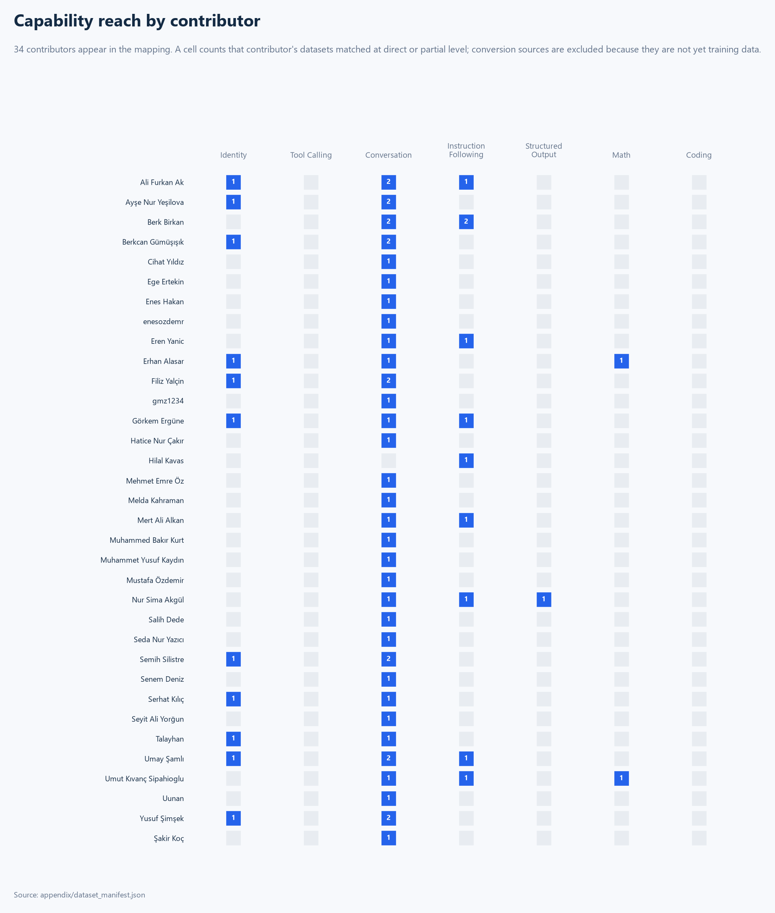

# Model Capability Mapping

[Main technical assessment](dataset-technical-assessment.md) ·
[Repository home](../README.md) ·
[Machine-readable manifest](../appendix/dataset_manifest.json)

This report maps 45 analyzed Hugging Face datasets against seven target
capability areas. It describes what each capability can and cannot be trained
from today, and what has to be authored. It does not score or rank datasets.

Two further datasets are in scope but could not be analyzed; they appear in no
mapping below and are recorded with evidence in
[`outputs/excluded_datasets.json`](../outputs/excluded_datasets.json).

## Technical summary

- **Conversation is well covered**: 29 direct sources spanning cuisine, health,
  law, sport, literature, commerce, education, and religion.
- **Identity is covered but self-contradictory**: nine purpose-built datasets
  answer the same canonical prompts with different names and developers.
- **Structured Output has its first direct source**: 17,454 schema-bound JSON
  answers, though 3,420 answers in the same dataset ignore that contract.
- **Tool Calling has content but no format**: six conversion sources, zero
  populated `tool_calls` fields anywhere in the collection.
- **Math is thin**: two partial sources, neither with verified numeric results.
- **Coding has no match at all.**

## Scope and matching criteria

The mapping is computed from
[`outputs/data_quality_profiles.json`](../outputs/data_quality_profiles.json)
and reviewed against each dataset's card and representative rows. Row counts in
[`appendix/dataset_manifest.json`](../appendix/dataset_manifest.json) and
[`appendix/capability_mapping.csv`](../appendix/capability_mapping.csv) are
generated from the profiles and validated against them on every run.

License status and the presence of train/validation/test splits are **not**
evaluation criteria here. They remain in the source metadata.

### Matching levels

| Level | Meaning |
|---|---|
| `direct` | The dataset is already in a training format for this capability |
| `partial` | It carries a relevant signal but is not sufficient alone |
| `conversion_source` | The content is valuable but the target schema does not exist yet. **A conversion source is not ready-made training data.** |
| `no_match` | No suitable record exists |

## Overall mapping

| Capability | Direct | Partial | Conversion sources | Status |
|---|---:|---:|---:|---|
| Identity | 9 | 2 | 0 | Completed, but conflicting |
| Tool Calling | 0 | 0 | 6 | Planned |
| Conversation | 29 | 12 | 0 | Planned |
| Instruction Following | 0 | 10 | 0 | Planned |
| Structured Output | 1 | 0 | 2 | In progress |
| Math | 0 | 2 | 1 | Planned |
| Coding | 0 | 0 | 0 | Planned |

Counts are matched datasets, not data volume. One dataset may appear under more
than one capability, so the columns are not additive portfolio totals.

The same mapping seen per contributor. Cells count datasets matched at direct or
partial level; conversion sources are excluded because they are not training
data yet, so a contributor whose only dataset is a conversion source does not
appear. Coverage is not a measure of quality.

## Identity — completed, but the sources contradict each other

Nine datasets exist to teach a model its own name, developer, purpose, and
limits:

| Dataset | Rows |
|---|---:|
| `hf/filiz-yalcin/identity-finetune` | 1,600 |
| `hf/ssilistre/semih-silistre-ai-identity` | 382 |
| `hf/samliumay/umay_samli_identification_dataset` | 219 |
| `hf/berkcangumusisik/voleykoc-identity-tr` | 182 |
| `hf/erhanalsr/langusta-identity` | 100 |
| `hf/sk75/sahin_identity` | 77 |
| `hf/YusufSimsek/llm-kisisellestirme` | 46 |
| `hf/aliFurkan123/identity` | 30 |
| `hf/Aysenur44/namaz-vakti-identity-tr` | 4 |

Two further datasets provide persona support alongside domain content:
`hf/gorkemergune/ayarlicazhocam_finetune` (429) and `hf/Talayhan/skatepal_dataset` (299).

**The blocking problem is not volume, it is contradiction.** Cross-dataset
overlap finds 87 shared user prompts across 30 dataset pairs and **zero shared
assistant answers**. The same questions — `sen kimsin`, `adın ne`, `görevin ne`,
`who are you` — appear in many of these datasets with a different name and
developer in each. Merging them trains the model to answer its own identity
inconsistently.

Quality also varies sharply. Answer duplication reaches 85.7% in
`hf/berkcangumusisik/voleykoc-identity-tr`, 80.0% in `hf/erhanalsr/langusta-identity`,
and 66.7% in `hf/samliumay/umay_samli_identification_dataset`.
`hf/sk75/sahin_identity` holds all 462 string-encoded `null` values in the
collection. `hf/filiz-yalcin/identity-finetune` is a renamed copy of an upstream
dataset and carries the collection's only two empty assistant answers.

**Gap.** Pick one persona. Then author safety principles, scope boundaries,
consistent refusal behavior, and an out-of-scope evaluation set — none of which
the current identity data contains.

## Tool Calling — content exists, format does not

**No dataset in the collection has a single populated `tool_calls` field.**

Six datasets are conversion sources because their content maps naturally onto
tool interfaces:

| Dataset | Rows | Plausible tools |
|---|---:|---|
| [hf/gururaser/ithaki-bilimkurgu-klasikleri](https://huggingface.co/datasets/gururaser/ithaki-bilimkurgu-klasikleri) | 103 | `search_books`, `filter_books`, `get_book_details` |
| [hf/sedayzc/trendyol-electronics-products-features-and-comments](https://huggingface.co/datasets/sedayzc/trendyol-electronics-products-features-and-comments) | 500 | `lookup_product`, `get_reviews`, `compare_specs` |
| [hf/sedayzc/turkish-electronics-product-comparison-recommendation](https://huggingface.co/datasets/sedayzc/turkish-electronics-product-comparison-recommendation) | 11,858 | `recommend_product`, `filter_by_budget` |
| [hf/Mer1Alii/TR-ECommerce-CustomerSupport-Instructions](https://huggingface.co/datasets/Mer1Alii/TR-ECommerce-CustomerSupport-Instructions) | 186 | `get_order_status`, `cancel_order`, `create_support_ticket` |
| [hf/namruni/meb-ogretmen-soru-cevap](https://huggingface.co/datasets/namruni/meb-ogretmen-soru-cevap) | 450 | `search_regulation`, `fetch_official_notice` |
| [hf/Aysenur44/namaz-vakti-dua-asistan-tr](https://huggingface.co/datasets/Aysenur44/namaz-vakti-dua-asistan-tr) | 60 | `get_prayer_times`, `resolve_location` |

Two of these are especially well suited because they are already structured
records rather than prose. Two others describe operations whose answers should be
computed rather than memorized: prayer times depend on location and date, and
regulation answers depend on the current text of the rules.

**Gap.** The tool role, function schema, arguments, tool result, error scenario,
and final user answer must all be authored. Conversion sources are raw material,
not training data.

## Conversation — the strongest area

Twenty-nine datasets are direct single-turn dialogue sources, covering cuisine
(34,244), electronics recommendations (11,858), proverbs (1,398), carpentry
support (1,211), biology (1,093), animation (1,020), interpersonal skills
(1,001), IT law (1,000), cooking (1,000), AI discussion (1,000), cyber security
(800), health (773 and 553), philosophy (529), figure skating (526), religious
history (509), general knowledge (500), teacher regulations (450), assistant
dialogue (429), statistics (400), skateboarding (299), classic literature (220),
e-commerce support (186), volleyball coaching (166), logistics (139), energy
(113), prayer times (60), and the Odyssey (10).

Twelve datasets are partial: the nine identity sets provide persona support
rather than domain dialogue, and the three generation sets (MEB question
generation, X engagement quotes and replies) use a template instruction in the
user turn rather than a natural question.

**Gap.** Every conversation in the collection is two or three messages. There is
no genuine follow-up turn, no correction, no reference to an earlier message, no
topic switch, and no long-context example. Multi-turn behavior cannot be trained
or measured from this collection.

## Instruction Following — domain answering, not instruction diversity

Ten datasets are partial matches because their user turn is an explicit
instruction: `hf/nursimakgul/meb-soru-uretme` (20,874),
`hf/berkbirkan/turkish-x-engagement-quotes` (1,000) and
`hf/berkbirkan/turkish-x-engagement-replies` (1,000),
`hf/Erenyanic/seasoned-advice-dataset` (1,000),
`hf/samliumay/turkish_cyber_security_controls_dataset` (800),
`hf/aliFurkan123/cultural-questions-dataset` (500),
`hf/gorkemergune/ayarlicazhocam_finetune` (429),
`hf/Toivo0/Turkce-istatistik-reasoning` (400),
`hf/Mer1Alii/TR-ECommerce-CustomerSupport-Instructions` (186), and
`hf/sadecebirisii/turkish-llm-authority-bypass-safety-sft` (29).

No dataset is a direct match. The instructions concentrate on a narrow band of
task types: answer a domain question, generate an exam question, write a short
social reply. Prompt duplication is high in exactly the datasets carrying the
most explicit instructions — 86.6% in `hf/nursimakgul/meb-soru-uretme` and about
68–70% in the two `hf/berkbirkan/turkish-x-engagement-*` sets — so instruction
variety is lower than the row counts imply.

**Gap.** Summarization, rewriting, classification, explicit format constraints,
multi-step tasks, and negative constraints ("do not include…") are all absent.

## Structured Output — one direct source, contract not enforced

[hf/nursimakgul/meb-soru-uretme](https://huggingface.co/datasets/nursimakgul/meb-soru-uretme)
is the collection's first direct Structured Output source. **17,454 of its 20,874
assistant answers are parseable JSON objects** with a consistent schema:
`metin`, `secenekler`, `dogru_cevap`, and `cevap_aciklamasi`.

The remaining **3,420 answers are not JSON at all**. Notably, zero answers are
malformed JSON — nothing starts a JSON object and then fails to parse. The
problem is an unenforced contract rather than data corruption, which is the
easier of the two to fix, but a model trained on this set as-is would learn to
produce JSON only most of the time.

The same repository also cannot be read through the Dataset Viewer, because each
JSONL line holds a bare JSON array instead of an object. Any consumer relying on
`load_dataset` gets nothing.

Two conversion sources remain: `hf/gururaser/ithaki-bilimkurgu-klasikleri`
(103 records, 17 fields) and
`hf/sedayzc/trendyol-electronics-products-features-and-comments` (500 records,
13 columns, with nested category lists, attribute maps, and review lists).

**Gap.** Enforce the schema on the non-conforming answers, add a validator, and
build prompt–schema–output triples for the two conversion sources.

## Math — narrow and unverified

Two partial sources:

- [hf/Toivo0/Turkce-istatistik-reasoning](https://huggingface.co/datasets/Toivo0/Turkce-istatistik-reasoning)
  (400 rows) covers seven statistics modules with conceptual, interpretation, and
  misconception question types, each with a reasoning trace and difficulty label.
- [hf/erhanalsr/langusta-kpss-reasoning](https://huggingface.co/datasets/erhanalsr/langusta-kpss-reasoning)
  (21 rows) is a filtered subset of an upstream reasoning dataset.

One conversion source: `hf/gururaser/ithaki-bilimkurgu-klasikleri` supports
price, discount, and percentage arithmetic only.

Neither partial source carries a machine-checkable final answer, and this audit
did not verify their arithmetic.

**Gap.** Verified solution steps, a separate `final_answer` field, unit handling,
recomputation tests, and coverage beyond statistics and exam questions.

## Coding — no match

There is no code generation, debugging, explanation, refactoring, testing, or
algorithm data in the collection.

The name of [hf/gmz1234/stackoverflow_ai](https://huggingface.co/datasets/gmz1234/stackoverflow_ai)
suggests otherwise, so it was checked specifically. Its 1,000 answers contain
**no fenced code blocks**. The content is AI Stack Exchange discussion prose
about neural networks, quantum computing, and reinforcement learning; tokens such
as "function" appear in their mathematical sense. It is a Conversation source in
English, not a Coding source.

**Gap.** Everything. Coding data must be authored or sourced externally.

## Target record and validation contract

| Area | Proposed record format | Required fields | Core validation |
|---|---|---|---|
| Identity | `messages` + persona metadata | `system`, `user`, `assistant`, `persona_id`, `language`, `policy_scope` | Identity consistency, boundary, and refusal behavior tests |
| Tool Calling | Tool definition + call + result + answer | `tools`, `tool_name`, `arguments`, `tool_result`, `assistant_final` | JSON Schema, tool name, argument type, and result dependency |
| Conversation | Multi-turn message sequence | `conversation_id`, `turn_index`, `role`, `content`, `topic` | Role order, context reference, and turn integrity |
| Instruction Following | Prompt–constraint–target triple | `instruction`, `constraints`, `input`, `target` | Constraint satisfaction and task type checks |
| Structured Output | Prompt + schema + output | `prompt`, `schema`, `target_json` | JSON parsing, schema conformance, and field type checks |
| Math | Problem + solution + answer | `problem`, `solution_steps`, `final_answer`, `unit` | Recomputation and unit consistency |
| Coding | Task + context + code + tests | `task`, `language`, `context`, `solution`, `tests` | Compile/run, test, and safe code checks |

## Implementation decisions

1. **Do not merge identity datasets.** Choose one persona and treat the rest as
   out of scope for that model.
2. **Build Tool Calling from the two structured sources first.**
   `hf/gururaser/ithaki-bilimkurgu-klasikleri` and
   `hf/sedayzc/trendyol-electronics-products-features-and-comments` already have
   field-level structure, so the tool schema follows directly from their columns.
3. **Fix the Structured Output contract before scaling it.** One dataset with an
   enforced schema is worth more than 20,874 rows with an optional one.
4. **Treat conversation coverage as breadth, not depth.** Twenty-nine domains at
   one turn each does not produce multi-turn behavior.
5. **Source Coding data externally.** No preparation of the current collection
   produces it.
